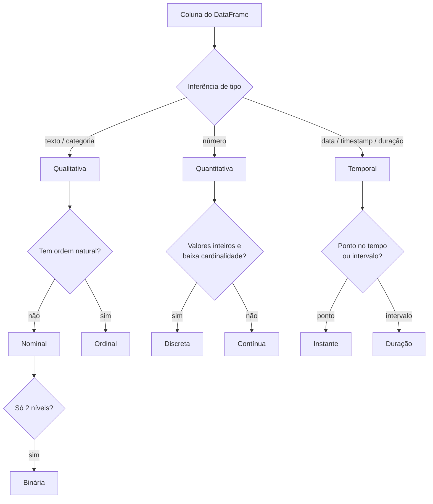

# Fluxo de análises descritivas do maat

Este documento é o mapa conceitual do maat: dado um DataFrame qualquer, **como classificamos cada variável e o que cada classificação nos permite dizer sobre os dados** — tanto em forma de resumos numéricos quanto em nível visual.

É um documento vivo de discussão. Cada seção lista as análises candidatas; ao consolidarmos, marcamos o que entra no MVP e o que fica para depois.

---

## 1. O fluxo geral



Regras de inferência (heurísticas iniciais, sempre sobrescrevíveis pelo usuário):

| Sinal na coluna | Tipo inferido |
|---|---|
| dtype categórico/string, cardinalidade baixa em relação a `n` | Qualitativa nominal |
| string com padrão de escala conhecida ("baixo/médio/alto", "P/M/G") ou ordem declarada | Qualitativa ordinal |
| exatamente 2 valores distintos (qualquer dtype) | Qualitativa binária |
| dtype numérico, todos inteiros, cardinalidade baixa | Quantitativa discreta |
| dtype numérico em geral | Quantitativa contínua |
| dtype date/datetime, ou string que parseia como data em alta taxa | Temporal (instante) |
| dtype timedelta, ou diferença entre colunas de data | Temporal (duração) |
| numérico com cardinalidade ≈ `n` e sem repetição (id) | Identificador — **excluída da análise** |
| string com cardinalidade ≈ `n` (texto livre, id) | Identificador / texto livre — **excluída do MVP** |

> **Armadilhas conhecidas**: CEP, código de produto e ano são números que *não* são quantitativos (não faz sentido somar CEPs). A inferência deve marcar esses casos como "suspeitos" e sugerir reclassificação. Ano é o caso mais ambíguo: pode ser temporal (eixo) ou ordinal (categoria de agrupamento) dependendo da pergunta.

---

## 2. Qualitativas

### 2.1 Nominal (sem ordem: cidade, categoria de produto, cor)

**Resumos numéricos**

| Análise | O que responde |
|---|---|
| Tabela de frequências (absoluta, relativa, % acumulada por rank) | Como os dados se distribuem entre as categorias? |
| Moda e força da moda (% da categoria dominante) | Existe uma categoria dominante? |
| Cardinalidade (nº de níveis distintos) | Quantas categorias existem? É gerenciável? |
| Razão de desbalanceamento (maior freq / menor freq) | As classes são equilibradas? |
| Entropia normalizada | A distribuição é concentrada ou espalhada? |
| Contagem/% de ausentes | Qualidade do dado |
| Categorias raras (< x% do total) | Candidatas a agrupamento em "Outros" |

**Visualizações**

| Visual | Quando usar |
|---|---|
| Barras ordenadas por frequência | Padrão para até ~15 categorias |
| Pareto (barras + linha acumulada) | Quando importa saber "quantas categorias explicam 80%?" |
| Lollipop | Alternativa limpa às barras com muitas categorias |
| Treemap | Alta cardinalidade com hierarquia ou muitos níveis pequenos |
| ⚠️ Pizza/donut | Só com ≤ 4 categorias — em geral, evitar |

### 2.2 Ordinal (com ordem: escolaridade, faixa de renda, satisfação 1–5)

Herda tudo da nominal, e a ordem habilita mais:

**Resumos numéricos adicionais**

| Análise | O que responde |
|---|---|
| Frequência acumulada **na ordem natural** | "Quantos % estão até o nível X?" |
| Categoria mediana e quartis categóricos | Onde está o centro da distribuição ordenada? |
| Assimetria da distribuição na escala ordinal | A massa está concentrada no topo ou na base da escala? |

**Visualizações**

| Visual | Quando usar |
|---|---|
| Barras **na ordem natural da escala** (nunca por frequência) | Padrão — a ordem é informação |
| Barras divergentes (escala Likert) | Escalas de concordância/satisfação centradas no neutro |
| Barra 100% empilhada única | Ver a composição inteira numa linha só |

### 2.3 Binária (sim/não, ativo/inativo)

Caso degenerado, mas frequente o bastante para merecer saída própria e enxuta:

- Proporção de cada nível + intervalo de confiança da proporção.
- Visual: um único indicador (barra de proporção ou "big number" com %). Gráfico de barras com 2 barras é desperdício de tela.

---

## 3. Quantitativas

### 3.1 Discreta (contagens: nº de filhos, nº de itens no pedido)

**Resumos numéricos**

| Análise | O que responde |
|---|---|
| Tabela de frequências por valor (se cardinalidade baixa) | Distribuição exata — discreta com poucos valores se comporta como ordinal |
| Mínimo, máximo, amplitude | Faixa de valores |
| Média, mediana, moda | Tendência central (a moda volta a ser útil aqui) |
| Variância, desvio padrão | Dispersão |
| % de zeros | Inflação de zeros é comum em contagens (nº de compras, nº de sinistros) |
| Contagem/% de ausentes | Qualidade do dado |

**Visualizações**

| Visual | Quando usar |
|---|---|
| Barras por valor exato | Cardinalidade baixa (cada valor inteiro é uma barra) |
| Histograma com bins inteiros | Cardinalidade média/alta |
| ECDF | Comparar "% de casos até k" |

### 3.2 Contínua (renda, altura, temperatura)

O caso mais rico da estatística descritiva clássica.

**Resumos numéricos**

| Grupo | Análises |
|---|---|
| Posição | média, mediana, quantis (p1, p5, p25, p75, p95, p99), mínimo, máximo |
| Dispersão | desvio padrão, variância, IQR, amplitude, coeficiente de variação (CV) |
| Forma | assimetria (skewness), curtose |
| Outliers | contagem pela regra 1.5×IQR; opcionalmente z-score robusto (MAD) |
| Qualidade | % ausentes, % de valores idênticos (constância), precisão decimal detectada |
| Diagnósticos | média ≫ mediana → sugerir escala log; concentração em valores redondos → possível arredondamento na coleta |

> Nota Spark: quantis exatos são caros em dados distribuídos — usar `approxQuantile` com erro configurável. O contrato do backend deve expor isso (exato no pandas, aproximado no Spark, com o erro reportado no resultado).

**Visualizações**

| Visual | Quando usar |
|---|---|
| Histograma | Padrão — forma geral da distribuição |
| Boxplot | Resumo compacto + outliers evidentes |
| Densidade (KDE) | Forma suavizada; sobreposição de grupos |
| Violino | Boxplot + densidade em um só |
| ECDF | Leitura direta de percentis, sem escolha de bins |
| QQ-plot (vs. normal) | Diagnóstico de normalidade — fase 2 |

---

## 4. Temporais — o tipo que não se encaixa

**Por que data nunca coube em qualitativa nem quantitativa?** Porque um timestamp carrega as duas naturezas ao mesmo tempo:

1. **Eixo contínuo**: o tempo é uma reta ordenada — dá para calcular mínimo, máximo, amplitude (cobertura), gaps. Isso é comportamento quantitativo (escala intervalar: diferenças fazem sentido, razões não — "dia 20" não é "duas vezes o dia 10").
2. **Componentes cíclicos**: mês, dia da semana, hora do dia são categorias **ordinais e circulares** (dezembro é "vizinho" de janeiro). Isso é comportamento qualitativo, mas com uma topologia que nem a ordinal comum tem.

A solução do maat: temporal é um **tipo de primeira classe** que, na análise, se **decompõe** — gera automaticamente derivadas qualitativas (mês, dia da semana, hora, trimestre) e quantitativas (posição na linha do tempo, durações), e cada derivada herda o fluxo de análise do seu tipo.

### 4.1 Instante (data da venda, timestamp do evento)

**Resumos numéricos**

| Análise | O que responde |
|---|---|
| Cobertura: mínimo, máximo, amplitude | Que período os dados cobrem? |
| Granularidade detectada (diária? horária? mensal?) | Qual a resolução real do dado? (se toda hora é 00:00, é diário disfarçado) |
| Contagem de registros por período | Volume ao longo do tempo — a análise temporal mais básica |
| Gaps e buracos (períodos sem registros) | Falhas de coleta ou sazonalidade extrema? |
| Duplicatas de timestamp | Eventos simultâneos são esperados? |
| Perfil cíclico: distribuição por mês, dia da semana, hora | Existe sazonalidade? (cada componente vira uma análise ordinal) |
| Datas no futuro / anteriores a limiar plausível (ex.: 1900) | Qualidade do dado |
| % ausentes | Qualidade do dado |

**Visualizações**

| Visual | Quando usar |
|---|---|
| Linha do tempo de contagens (por dia/semana/mês) | Padrão — volume ao longo do tempo |
| Barras por componente cíclico (dia da semana, mês, hora) | Sazonalidade — um painel por componente |
| Heatmap calendário | Padrões diários em períodos longos (estilo GitHub) |
| Heatmap hora × dia da semana | Padrões de comportamento intra-semana |
| Faixa de gaps sobre a linha do tempo | Evidenciar buracos de coleta |

### 4.2 Duração (tempo de entrega, tempo de sessão)

Durações **são** quantitativas contínuas (razões fazem sentido: 4h é o dobro de 2h) — herdam toda a seção 3.2. O que muda:

- Unidade de exibição inteligente (segundos → minutos → horas → dias conforme a magnitude).
- Distribuições de duração são quase sempre assimétricas à direita → sugerir log/percentis por padrão, e mediana como resumo principal (não média).
- Durações negativas = erro de dado → checagem de qualidade específica.

---

## 5. Análises bivariadas (cruzamentos)

A matriz tipo × tipo define o que faz sentido cruzar. MVP: usuário escolhe os pares; futuro: sugestão automática dos pares mais informativos.

| | Qualitativa | Quantitativa | Temporal |
|---|---|---|---|
| **Qualitativa** | Tabela de contingência (absoluta e %), qui-quadrado, V de Cramér · *Visual*: heatmap, barras agrupadas/100% empilhadas | — | — |
| **Quantitativa** | Estatísticas por grupo (média, mediana, dp por categoria) · *Visual*: boxplots lado a lado, densidades sobrepostas | Correlação (Pearson, Spearman) · *Visual*: dispersão (+ amostragem/hexbin no Spark), linha de tendência | — |
| **Temporal** | Contagem por período quebrada por categoria · *Visual*: linhas múltiplas, área 100% empilhada (composição ao longo do tempo) | Agregado (média/mediana/soma) por período · *Visual*: linha temporal da métrica, com banda de quantis | (raro — ex.: duração vs. data do evento → tratado como temporal × quantitativa) |

> Nota Spark: dispersão com milhões de pontos não é plotável — o backend deve amostrar ou pré-agregar (hexbin/grade 2D) antes de qualquer visual quanti × quanti.

---

## 6. O que uma análise devolve (contrato de saída)

Para manter pandas e Spark equivalentes, toda análise devolve uma estrutura padronizada, independente do backend:

```
ColumnProfile
├── name, inferred_type, confiança da inferência
├── quality: {n, n_missing, pct_missing, alertas de qualidade}
├── summary: dict de estatísticas (as tabelas das seções 2–4)
├── viz_suggestions: lista ordenada de {tipo_de_gráfico, dados_pré-agregados, motivo}
└── notes: observações geradas ("distribuição assimétrica — considere escala log")
```

Ponto importante para o Spark: **as visualizações nunca recebem os dados brutos** — recebem os dados já agregados/amostrados pelo backend (contagens por bin, frequências por categoria). Assim o custo distribuído fica no backend e a camada visual é sempre local e leve.

---

## 7. Questões em aberto (para discutirmos)

1. **Limiar de cardinalidade**: com quantos níveis uma string deixa de ser categórica e vira "texto livre/id"? Fixo (ex.: 50) ou relativo (ex.: > 20% de `n`)?
2. **Ordem das ordinais**: inferimos por dicionários de escalas conhecidas (pt/en) ou exigimos declaração do usuário no MVP?
3. **Amostragem no Spark**: qual o padrão de erro aceitável para `approxQuantile` e qual o tamanho de amostra para visuais?
4. **Saída do relatório**: HTML estático primeiro? Ou dict/JSON estruturado primeiro e o HTML como renderização por cima (recomendado)?
5. **Texto livre**: fora do MVP, mas vale reservar o tipo na taxonomia desde já (contagem de tokens, comprimento médio)?
