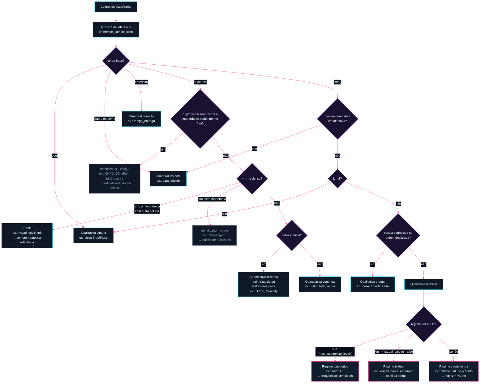
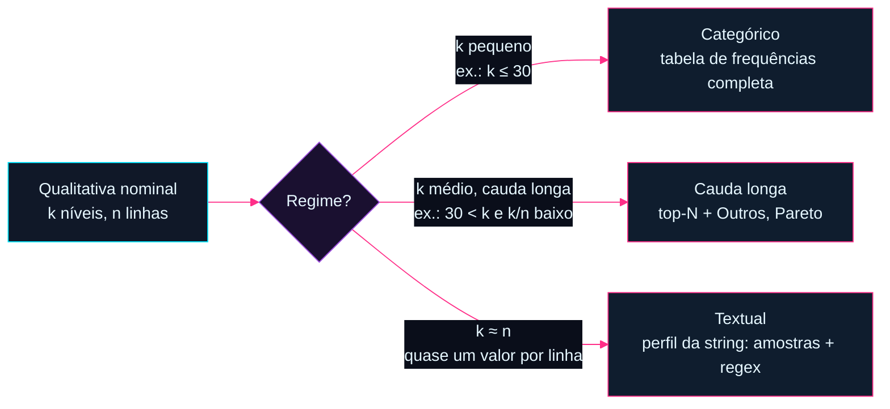

# Fluxo de análises descritivas do maat

Este documento é o mapa conceitual do maat: dado um DataFrame qualquer, **como classificamos cada variável e o que cada classificação nos permite dizer sobre os dados** — tanto em forma de resumos numéricos quanto em nível visual.

É um documento vivo de discussão. Cada seção lista as análises candidatas; ao consolidarmos, marcamos o que entra no MVP e o que fica para depois.

> ✅ **Implementado desde 2026-08-23.** Tudo abaixo roda em pandas e PySpark, validado sobre 38 datasets e 609 colunas reais. Cada decisão consolidada tem teste que a protege em `tests/` — se um quebrar, ou o código regrediu ou a decisão mudou. A única seção ainda não implementada é a §5 (bivariadas), adiada por decisão.

> 🖥️ **Versão interativa**: [`fluxo-interativo.html`](fluxo-interativo.html) — o fluxo de classificação como grafo arrastável, com exemplos e análises no hover de cada nó, na identidade visual do projeto. Versão pública: https://samnkb.github.io/maat/fluxo-interativo.html

---

## 0. Princípios de projeto

1. **A inferência propõe, o usuário dispõe** — todo tipo inferido é sobrescrevível; ambiguidades (cep, ano, rank) são marcadas e apresentadas, nunca decididas em silêncio.
2. **O maat descreve, não julga** *(decisão de 2026-08-16)* — mostramos o que o dado revela naquele momento: contagens, proporções, distribuições, amostras. Sem quality gates, sem limiares de alerta, sem policiar a codificação que o usuário escolheu para os dados dele. O que fazer com o resultado é decisão de quem lê. (Corolário: as checagens do regime textual reportam contagens e amostras de ofensores — nunca um veredito de "aprovado/reprovado".)

   **Corolário — mostrar é obrigação, agir é do usuário** *(2026-08-16)*: "não julgar" nunca significa "esconder". Se o dado tem um problema visível, o maat **mostra o fato** e o usuário decide se corrige — omitir deixaria um dataset ruim passar despercebido. A condição: toda detecção usa **critério determinístico e explícito**, declarado junto do resultado (ex.: "níveis idênticos ao normalizar para minúsculas, sem acentos e com espaços colapsados"), nunca inferência difusa ou semelhança aproximada. O maat nunca une, corrige ou sugere correção — só relata o que a regra encontrou.
3. **Duas camadas em todo perfil** *(decisão de 2026-08-16)* — camada **essencial** (o que qualquer pessoa lê: contagens, %, moda) e camada **completa** (para quem quer profundidade: entropia, razões, forma da distribuição). Medidas que exigem contexto estatístico moram na completa.
4. **O custo mora no backend** — agregações rodam no motor (pandas/Spark); a camada visual recebe apenas dados pré-agregados.

---

## 1. O fluxo geral

O fluxograma completo, do dado bruto até a estratégia de análise — todo losango com parâmetro entre parênteses é configurável pelo usuário (seção 1.2):



### 1.1 Exemplo guiado: `vendas.csv` (100.000 linhas)

Como o classificador enxerga cada coluna de uma tabela de vendas típica:

| Coluna | Amostra de valores | k (distintos) | Classificação | Regime | Por quê |
|---|---|---|---|---|---|
| `id_pedido` | 10001, 10002, … | 100.000 | Identificador | — | inteiro com um valor único por linha; média de id não significa nada |
| `cliente_nome` | "Ana Souza", "J. Pereira" | 98.400 | Nominal | Textual | k ≈ n → frequência é inútil; analisa-se a string (seção 2.4) |
| `cliente_email` | "ana@gmail.com", … | 99.100 | Nominal | Textual | idem; padrão dominante detectado: e-mail |
| `cidade` | "São Paulo", "Recife", … | 3.200 | Nominal | Cauda longa | muita repetição, mas níveis demais para tabela completa |
| `uf` | "SP", "PE", … | 27 | Nominal | Categórico | k pequeno → todos os níveis no resumo |
| `sexo` | "F", "M" | 2 | Binária | — | exatamente 2 níveis |
| `avaliacao` | 1, 2, 3, 4, 5 | 5 | **⚠️ Ordinal (reclassificada)** | Categórico | a heurística diria "discreta" (inteiros, k baixo) — mas é escala Likert: 5 não é "5 unidades", é "melhor que 4". Caso clássico de reclassificação pelo usuário |
| `qtd_itens` | 1, 2, 3, … 14 | 14 | Quantitativa discreta | — | inteiros de contagem: 4 itens **são** o dobro de 2 |
| `valor_total` | 129.90, 45.00, … | 71.000 | Quantitativa contínua | — | casas decimais: mede, não conta |
| `cep` | "01310-100", … | 45.000 | **⚠️ Suspeita** | — | máscara de código: somar/mediar CEP não faz sentido; usuário decide (id? região via prefixo?) |
| `data_pedido` | 2024-05-01 14:32 | — | Temporal instante | — | dtype datetime |
| `tempo_entrega` | 2d 4h 12min | — | Temporal duração | — | dtype timedelta (ou derivada de duas datas) |

As linhas de `avaliacao` e `cep` mostram o princípio central: **a inferência propõe, o usuário dispõe** — todo tipo é sobrescrevível, e os casos ambíguos são marcados em vez de decididos em silêncio.

> 📊 **Exemplos com dados reais**: o [grafo interativo](fluxo-interativo.html) referencia números verdadeiros do benchmark em cada nó (telco `Churn`: No 5.174 · Yes 1.869; titanic `SibSp`: 68,2% zeros; nyc-airbnb `name`: k/n = 0,98; wine `quality`: moda 5 com 42,6%…). Todos reproduzíveis via [`scripts/benchmark_examples.py`](../scripts/benchmark_examples.py).

### 1.2 Parâmetros do usuário

Os limiares de classificação não são constantes do maat — são parâmetros com defaults, expostos numa configuração única ([`maat.Config`](../src/maat/core/config.py), implementada):

```python
import maat

profile = maat.describe(df, config=maat.Config(
    max_categorical_levels=30,     # até aqui, regime categórico (frequências completas)
    textual_unique_ratio=0.5,      # fração de valores únicos acima da qual vira regime textual
    max_discrete_levels=30,        # discreta: até k distintos → regime tabela; acima → regime histograma
    discrete_extremes_levels=5,    # regime histograma: n valores mais e n menos frequentes na tabela de extremos
    discrete_extremes_include_middle=False,  # opt-in: acrescenta os n valores do meio do ranking (o histograma já retrata o corpo)
    continuous_extremes_levels=5,  # contínua: n maiores e n menores valores observados na tabela de extremos
    long_tail_top_n=10,            # cauda longa: n níveis na tabela, mais a linha "Outros"
    ordinal_levels={},             # ordem declarada por coluna, ex.: {"tamanho": ["P", "M", "G"]}
    rank_monotonia_minima=0.99,    # |Spearman| contra outra coluna a partir do qual vira rank (§3.3)
    textual_sample_size=5,         # n de cada amostra dirigida: mais curtas, mais longas, aleatórias
    textual_extra_checks=[],       # checagens próprias: {"nome":..., "regex":..., "descricao":...}
    date_format={},                # formato declarado por coluna quando indecidível, ex.: {"data": "dd/mm"}
    date_horizons=[10, 20, 30, 40, 50, 100],  # faixas (anos) do perfil de horizonte temporal
    temporal_extremes_levels=5,    # n datas mais antigas e mais futuras na amostra de extremos
    # saída (§6): formato é escolhido no método — profile.to_markdown(camada="essencial")
    inference_sample_size=100_000, # linhas amostradas para inferência (None = base inteira)
    sample_size=10,                # N das amostras dirigidas (strings mais curtas/longas, ofensores)
))
```

`inference_sample_size` existe por dois motivos: custo (no Spark, inferir tipos na base inteira é um job pesado) e suficiência (100 mil linhas bastam para decidir se uma coluna é nominal ou textual). A contagem exata de `k` da análise final continua vindo da base inteira — a amostra é só para a **decisão de rota**. Os defaults acima são propostas iniciais a calibrar com uso real.

Regras de inferência (heurísticas iniciais, sempre sobrescrevíveis pelo usuário):

| Sinal na coluna | Tipo inferido |
|---|---|
| dtype categórico/string, cardinalidade baixa em relação a `n` | Qualitativa nominal |
| string com padrão de escala conhecida ("baixo/médio/alto", "P/M/G") ou ordem declarada | Qualitativa ordinal |
| exatamente 2 valores distintos (qualquer dtype) | Qualitativa binária |
| dtype numérico, todos inteiros | Quantitativa discreta — o `k` decide o **regime**: tabela (k baixo) ou histograma (k alto) |
| dtype numérico com casas decimais | Quantitativa contínua |
| dtype date/datetime, ou string que parseia como data em alta taxa | Temporal (instante) |
| dtype timedelta, ou diferença entre colunas de data | Temporal (duração) |
| numérico que passa em dígito verificador, tem zeros à esquerda ou comprimento fixo | **Identificador · código** (§3.3) — cardinalidade, nunca média |
| numérico denso e único com \|Spearman\| ≥ 0,99 contra outra coluna | **Rank** (§3.3) — sempre nomeando a coluna de referência |
| numérico com cardinalidade ≈ `n` e sem repetição (id) | **Identificador · chave** — unicidade e colisões |
| string com cardinalidade alta (nome, e-mail, endereço) | Qualitativa nominal em **regime textual** (seção 2.4) |

> **Armadilhas conhecidas**: CEP, código de produto e ano são números que *não* são quantitativos (não faz sentido somar CEPs). A inferência deve marcar esses casos como "suspeitos" e sugerir reclassificação. Ano é o caso mais ambíguo: pode ser temporal (eixo) ou ordinal (categoria de agrupamento) dependendo da pergunta.

---

## 2. Qualitativas

### 2.0 Regimes de cardinalidade

Dentro de um mesmo tipo, **a quantidade de níveis muda completamente qual análise faz sentido**. "Sexo" (2–3 níveis) e "e-mail" (um nível por linha) são ambas strings nominais, mas pedem tratamentos opostos. O maat trabalha com três regimes, decididos pela cardinalidade `k` em relação ao total `n`:



| Regime | Exemplo | Estratégia |
|---|---|---|
| **Categórico** (`k` pequeno) | sexo, UF, canal de venda | Tabela de frequências completa — todo nível aparece no resumo e no gráfico |
| **Cauda longa** (`k` médio, muita repetição) | cidade, categoria de produto, CID | Top-N + agregado "Outros"; análise de concentração (Pareto); categorias raras |
| **Textual** (`k` ≈ `n`, quase sem repetição) | nome, e-mail, endereço, descrição | A frequência é inútil (tudo tem contagem ~1) — o objeto de análise passa a ser **a string em si**: comprimentos, amostras extremas, padrões e sujeira via regex (seção 2.4) |

Os limiares exatos entre regimes são **parâmetros do usuário** (seção 1.2) — resta calibrar os defaults com uso real. Importante: o regime **não é um tipo** — é um modificador que seleciona a estratégia dentro do tipo. Uma coluna pode migrar de regime quando os dados crescem.

### 2.1 Nominal em regime categórico (sexo, UF, canal de venda)

**Resumos numéricos**

| Análise | O que responde |
|---|---|
| Tabela de frequências (absoluta, relativa, % acumulada por rank) | Como os dados se distribuem entre as categorias? |
| Moda e força da moda (% da categoria dominante) | Existe uma categoria dominante? |
| Cardinalidade (nº de níveis distintos) | Quantas categorias existem? É gerenciável? |
| Razão de desbalanceamento (maior freq / menor freq) | As classes são equilibradas? |
| Entropia normalizada | A distribuição é concentrada ou espalhada? |
| Contagem/% de ausentes | Qualidade do dado |
| Categorias raras (< x% do total) | Candidatas a agrupamento em "Outros" |

**Visualizações**

| Visual | Quando usar |
|---|---|
| Barras ordenadas por frequência | Padrão para até ~15 categorias |
| Lollipop | Alternativa limpa às barras quando há mais categorias |
| ⚠️ Pizza/donut | Só com ≤ 4 categorias — em geral, evitar |

### 2.2 Nominal em regime cauda longa (cidade, fornecedor) — ✅ consolidada em 2026-08-16

> 🔍 **Página detalhada**: [tipos/cauda-longa.html](tipos/cauda-longa.html) ([versão pública](https://samnkb.github.io/maat/tipos/cauda-longa.html)).

Muitos níveis com repetição relevante: a frequência ainda é o objeto de análise, mas mostrar todos os níveis deixa de ser viável. Protagonistas do benchmark: `neighbourhood` do nyc-airbnb (mansa: k=221, sem variantes) e `txtFornecedor` da cota parlamentar da Câmara (selvagem: k=22.024, 43,1% singletons, 279 grupos de variantes de grafia).

**Camada essencial** *(decisões de 2026-08-16)*:

| Saída | Detalhe |
|---|---|
| **Top-10 + linha "Outros"** | `long_tail_top_n` (default 10). A linha "Outros" informa quantos níveis agrega e sua participação — nunca esconde o tamanho da cauda |
| **Concentração** | Quantos níveis acumulam **50% / 80% / 95%** dos registros. É a leitura que define o regime, em frase pronta: *"36 de 221 bairros concentram 80% dos anúncios"* |
| **Cardinalidade e singletons** | `k` e quantos níveis aparecem uma única vez (Câmara: 9.496 · 43,1% dos níveis) |
| **Contagem de grupos de variantes** | *"279 grupos de níveis tornam-se idênticos ao normalizar"* — o número no essencial; a lista, na completa |

**Camada completa**: índice de concentração (Herfindahl e entropia normalizada, para comparar colunas entre si), lista dos grupos de variantes com suas frequências, e a cauda completa disponível sob demanda.

**Variantes de grafia — o fato que o top-N esconde** *(decisão de 2026-08-16)*: o maat relata grupos de níveis que se tornam **idênticos sob normalização determinística** — minúsculas + remoção de acentos + espaços colapsados + bordas aparadas. Esse critério é **declarado junto do resultado**, é reproduzível e não envolve semelhança aproximada. Caso real da Câmara:

| Nível como está na base | Frequência |
|---|---|
| `UBER DO BRASIL TECNOLOGIA LTDA.` | 10.267 |
| `Uber Do Brasil Tecnologia Ltda.` | 8 |

A mesma empresa dividida em dois níveis pela caixa — sem essa saída, a concentração real fica subestimada e o dataset ruim passa despercebido. **O maat nunca une, corrige nem sugere correção**: mostra o fato e o usuário decide (princípio §0.2, corolário "mostrar é obrigação, agir é do usuário").

**Visualizações**

| Visual | Camada | Quando usar |
|---|---|---|
| Pareto (barras top-10 + linha acumulada) | Essencial | Padrão do regime — mostra concentração e cauda juntas |
| Barras top-10 + "Outros" destacada | Essencial | Versão simples, sem eixo duplo |
| Treemap | Completa | Quando há hierarquia ou muitos níveis médios |

### 2.3 Ordinal (escolaridade, satisfação 1–5, faixa etária) — ✅ consolidada em 2026-08-16

> 🔍 **Página detalhada**: [tipos/ordinal.html](tipos/ordinal.html) ([versão pública](https://samnkb.github.io/maat/tipos/ordinal.html)).

**Modelagem**: a ordinal é **tipo próprio que herda toda a análise da nominal** (incluindo os regimes de cardinalidade) e acrescenta o que só a ordem permite. Sem ordem disponível, degrada sozinha para nominal e informa o usuário.

**O que a ordem realmente habilita** *(pergunta levantada pelo Sam em 2026-08-16: "qual métrica dependeria de fato da ordenação?")* — a resposta honesta é curta, e a distinção importa:

| Saída | Depende da ordem? |
|---|---|
| Tabela na ordem natural da escala | ❌ **Cosmético** — os números são idênticos, muda a ordem das linhas |
| **Frequência acumulada na ordem natural** | ✅ Responde *"quanto da massa está até este nível?"* (wine: 46,5% até nota 5; 86,4% até 6). **Não confundir com o acumulado do Pareto** (§2.2), que ordena por frequência e responde "quantos níveis dominam?" — perguntas diferentes |
| **Categoria mediana e quartis categóricos** | ✅ A mais relevante: para nominal, a única medida de tendência central válida é a moda; com ordem, a mediana passa a existir. No wine, moda = 5 mas **mediana = 6** — e a mediana é a leitura correta para escala ordinal |
| Média | ❌ **Inválida mesmo quando os níveis são números**: a distância entre 5 e 6 não é comparável à de 7 para 8 |
| Correlação ordinal (Spearman/Kendall), comparação de grupos | ✅ Fase bivariada (§5) — impossíveis sem ordem |

**Como a ordem chega** *(decisão de 2026-08-16 — só caminhos determinísticos)*:

1. **Declarada pelo usuário** — `maat.Config(ordinal_levels={"tamanho": ["P", "M", "G"]})`. Risco zero, sempre disponível.
2. **Número inicial no próprio rótulo** — única inferência automática aceita, por ser regra determinística e sem ambiguidade: `5-14 years` < `15-24 years` < `25-34 years` (suicide-rates), `0-10` < `11-20`.

**Fora, por decisão**: dicionário de escalas conhecidas (baixo/médio/alto) e leitura de coluna irmã numérica (adult: `education` + `education.num`). Ambos cobririam mais casos, mas ao custo de erro silencioso dependente de idioma e cultura — desproporcional para um ganho de duas medidas. *(Coerente com §0.2: critérios determinísticos e explícitos, nunca inferência difusa.)*

**Sem ordem**: roda como nominal e registra a observação — *"possível ordinal: declare a ordem dos níveis para habilitar acumulada e categoria mediana"*. Mostra o fato, o usuário decide (§0.2).

**Visualizações**

| Visual | Camada | Quando usar |
|---|---|---|
| Barras **na ordem natural** (nunca por frequência) | Essencial | Padrão — a ordem é informação |
| Curva de acumulada sobre as barras | Essencial | Mostra a leitura "até o nível X" |
| Barras divergentes (Likert) | Completa | Escalas de concordância centradas no neutro |
| Barra 100% empilhada única | Completa | Composição inteira em uma linha |

### 2.4 Nominal em regime textual (nome, e-mail, endereço) — ✅ consolidada em 2026-08-17

> 🔍 **Página detalhada**: [tipos/textual.html](tipos/textual.html) ([versão pública](https://samnkb.github.io/maat/tipos/textual.html)).

Quando `k ≈ n`, contar frequências não diz nada — cada valor aparece uma vez. O objeto de análise vira **a própria string**, em três frentes: forma, padrão e sujeira. Como inspecionar milhões de strings é inviável, o método é **estatísticas globais + amostras dirigidas**.

**Decisões de 2026-08-17**:

| Questão | Decisão |
|---|---|
| Quais checagens | **As 15 da bateria** (frente 3) **+ interface para o usuário registrar as próprias** (`nome`, `regex`, `descrição`) desde o MVP |
| Lista de palavrões | **Fora** — apontar palavrão é juízo de conteúdo, não descrição de dado, e depende de idioma (mesma objeção que derrubou o dicionário de nomes de coluna). No lugar entrou **`placeholder`**: preenchimento de teste (`asdasd`, `xxx`, `123123`, `null`), que é sinal de qualidade e não juízo moral |
| Máscara de caractere | Camada **completa** |
| Amostras dirigidas | Mais longas, mais curtas **e aleatórias** — a aleatória mostra o caso típico, que os extremos escondem |
| Padrão dominante | Reporta **aderência + amostra das violações** juntas: *"contaminações devem surgir no relatório"* |
| Execução | **Sempre na base inteira** — exatidão acima de velocidade. Medimos uma alternativa de duas fases (amostra detecta, base conta) que é 6× mais rápida, mas ela pode perder sujeira rara ausente da amostra. Rejeitada por decisão |

**Custo medido** (`scripts/custo_bateria_textual.py`, em dados reais): **~11 µs por string** para a bateria completa — 0,8 s em 48 mil strings, 24 s em 2,08 milhões. A máscara custa 1/3 disso; as amostras dirigidas são desprezíveis (0,5 s em 2 milhões). Testamos também combinar tudo numa regex única: só 1,2× mais rápido — não vale a complexidade. No Spark o custo se dilui em paralelo.

**Frente 1 — Forma (estatísticas de comprimento e estrutura)**

O comprimento da string é uma variável quantitativa derivada — herda a análise da seção 3:

| Análise | O que responde |
|---|---|
| Distribuição de comprimento (mín, mediana, máx, histograma) | Existe um comprimento "normal"? Bimodalidade sugere dois tipos de dado misturados |
| Amostra das N strings mais curtas, mais longas **e N aleatórias** | Curtas demais = truncamento, "a", "-", "." usados como preenchimento |
| Amostra das N strings mais longas | Longas demais = campo usado para outra coisa (observações coladas no nome) |
| Nº de tokens/palavras (distribuição) | Nome com 1 token ou 12 tokens é suspeito |
| % de valores vazios-disfarçados ("", " ", "N/A", "null", "-", "sem informação") | Ausência que não aparece como ausência |

**Frente 2 — Padrão (o campo tem um formato esperado?)**

| Análise | O que responde |
|---|---|
| Detecção de padrão dominante via regex (e-mail, URL, telefone, CPF/CNPJ, CEP, UUID) | Que tipo de dado este campo realmente contém? |
| % de aderência ao padrão dominante + amostra das violações | Quanto do campo está "quebrado" e como |
| Máscara de caractere (abstrair `Aa9` : "Rua X, 123" → "Aaa A, 999") e top máscaras | Enxergar os formatos coexistentes sem ler as strings |
| Consistência de caixa (% minúscula, MAIÚSCULA, Título, MiStA) | Padronização de entrada |

**Frente 3 — Sujeira (a bateria de 15 checagens)**

Cada checagem devolve contagem, % e uma **amostra dos ofensores** — a amostra é o que torna o achado acionável. Ocorrências reais medidas no benchmark:

| Checagem | Detecta | Ocorrência real medida |
|---|---|---|
| `espaco_borda` | espaço no início/fim | 238 no `name` do nyc · 188 no SMS |
| `espaco_duplo` | espaços consecutivos | 1.435 no nyc · **1.449** nos fornecedores da Câmara |
| `invisivel` | zero-width, NBSP, BOM | 3 no nyc — invisíveis ao olho, quebram joins |
| `nao_imprimivel` | controle / lixo binário | — |
| `repeticao` | 4+ caracteres iguais seguidos | 92 no nyc · 165 no SMS |
| `mojibake` | dupla codificação UTF-8/Latin-1 (`é`) | — |
| `html_residual` | entidade ou tag HTML | 309 no SMS · **312** na Câmara |
| `url` | URL embutida | **89 no SMS spam** |
| `markdown` | `**negrito**`, `[link](url)`, cercas de código | **71 nos nomes do nyc-airbnb** |
| `pix_brcode` | payload PIX copia-e-cola (`br.gov.bcb.pix`, prefixo `000201` + CRC16) | — (caso real relatado em produção) |
| `base64_longo` | payload codificado dentro do campo | — |
| `json_embutido` | JSON ou lista dentro da célula | 1 no google-play |
| `cpf_cnpj_mascara` | CPF/CNPJ onde deveria haver texto | **2 nos fornecedores da Câmara** |
| `placeholder` | preenchimento de teste (`asdasd`, `xxx`, `123123`, `null`) | 1 no nyc (`xxx`) |
| `misto_alfabeto` | latino + cirílico/grego no mesmo valor | 3 no nyc · 13 no google-play |

> O `markdown` disparando 71 vezes em **nomes de anúncio** e o CPF/CNPJ aparecendo em **campo de fornecedor** são exemplos do que a bateria existe para revelar: contaminação de um tipo de conteúdo em campo destinado a outro.

**Extensão pelo usuário** (decidida no MVP): registrar checagens próprias com `nome`, `regex` e `descrição` — a bateria embutida é o piso, não o teto.

> Nota Spark: todas as checagens são `filter`/`regexp` distribuídos + `take(N)` para amostras. A máscara de caractere é um `regexp_replace` encadeado.

**Visualizações**

| Visual | Quando usar |
|---|---|
| Histograma de comprimento | Padrão do regime — a forma da coluna |
| Barras das top máscaras de caractere | Formatos coexistentes no campo |
| Painel de qualidade (barras: % de cada checagem que disparou) | Resumo executivo da sujeira |
| Tabela de amostras dirigidas (curtas, longas, violações) | Não é gráfico, mas é a saída mais acionável do regime |

> Nota Spark: todas as checagens são `filter`/`regexp` distribuídos + `take(N)` para amostras — baratas mesmo em bilhões de linhas. A máscara de caractere é um `regexp_replace` encadeado.

### 2.5 Binária (sim/não, ativo/inativo) — ✅ consolidada em 2026-08-16

> 🔍 **Página detalhada**: [tipos/binaria.html](tipos/binaria.html) — decisões, exemplos reais do benchmark e visuais ([versão pública](https://samnkb.github.io/maat/tipos/binaria.html)). Também acessível clicando no nó "Qualitativa binária" do grafo interativo.

Caso degenerado, mas frequente o bastante para merecer saída própria e enxuta.

**Camada essencial** — tabela de frequência com o nulo como cidadão de primeira classe. Números reais de `Churn` no dataset telco-churn do benchmark (n = 7.043; reproduzível via `scripts/benchmark_examples.py`):

| nível | absoluto | % do total | % dos válidos |
|---|---|---|---|
| No | 5.174 | 73,5% | 73,5% |
| Yes | 1.869 | 26,5% | 26,5% |
| *(ausente)* | 0 | 0,0% | — |

As duas colunas de % eliminam a ambiguidade "% de tudo ou % de quem respondeu?" quando há nulos. (Curiosidade do benchmark: os famosos 11 valores em branco do telco não estão em `Churn` — estão em `TotalCharges`, numérico-em-string; um lembrete de verificar antes de exemplificar.)

**Camada completa**: nível dominante e razão de balanceamento (ex.: 2,8:1) — mora aqui porque razões exigem leitura estatística.

**Fora, por decisão**:
- *Intervalo de confiança* — inferência, não descrição; o maat não presume que o dado é amostra de algo maior.
- *Checagem de codificação e detecção de par semântico* — o maat não julga como o usuário codifica seus dados (princípio 2). Quando as bivariadas chegarem, o nível de referência será declarado pelo usuário.
- *Alertas por limiar* — quality gate é papel de outra ferramenta. Nota: um 3º valor distinto não é aviso — a coluna simplesmente deixa de ser binária e a classificação a leva para nominal.

**Visual**: barra única de proporção ou big number. Gráfico com duas barras é desperdício de tela.

---

## 3. Quantitativas

### 3.1 Discreta (contagens: nº de filhos, nº de itens no pedido) — ✅ consolidada em 2026-08-16

> 🔍 **Página detalhada**: [tipos/discreta.html](tipos/discreta.html) ([versão pública](https://samnkb.github.io/maat/tipos/discreta.html)), também via clique no nó do grafo interativo.

**Decisão estrutural**: contagem é contagem — **inteiros são sempre discreta**, independente da cardinalidade. O `k` escolhe o **regime de apresentação** (mesma filosofia dos regimes da nominal, seção 2.0):

| Regime | Quando | Exemplo real | Apresentação |
|---|---|---|---|
| **Tabela** | `k ≤ max_discrete_levels` | titanic `SibSp` (k=7) | frequência por valor exato — mostra tudo, inclusive buracos (não existe SibSp=6) |
| **Histograma** | `k` acima do limiar | ecommerce `Quantity` (k=722) | histograma de bins inteiros + resumo + **tabela de extremos de frequência** |

**Camada essencial**: tabela por valor (regime tabela) com ausentes como linha, mínimo, máximo, moda, **média e mediana** — o par média × mediana já conta a história da assimetria sem jargão (`SibSp`: média 0,52 vs mediana 0).

**Camada completa**: desvio padrão, quartis, % de zeros (no regime tabela o zero já aparece na tabela; no histograma o % de zeros vira estatística própria — `Parch`: 76,1% zeros).

**Fora, por decisão** (2026-08-16): **soma total** — mesmo sendo significativa em contagens (`SibSp` soma 466; `Quantity` soma 5.176.450), é leitura de negócio, não descrição de distribuição; o usuário soma por conta própria se quiser.

**Tabela de extremos de frequência** *(decisão de 2026-08-16)*: no regime histograma a tabela de frequência não morre — encolhe. Entram os `discrete_extremes_levels` valores **mais frequentes** e os mesmos **menos frequentes** (default 5 + 5, parametrizável). No `Quantity` real: os mais frequentes revelam o varejo — 1 (27,4%), 2 (15,1%), **12 (11,3% — a dúzia)**, 6, 4; nos menos frequentes, os 308 valores empatados em frequência 1 são desempatados pelos **mais extremos primeiro**, entregando exatamente os outliers que contam história: ±80.995 e ±74.215 (pedidos gigantes e seus cancelamentos).

Nota do regime histograma: valores negativos aparecem como fato no mín/máx e na cauda do histograma (`Quantity`: mín -80.995, 1,96% negativos — devoluções), sem juízo de "erro".

**Visualizações**

| Visual | Quando usar |
|---|---|
| Barras por valor exato | Regime tabela — cada valor inteiro é uma barra |
| Histograma com bins inteiros | Regime histograma |
| ECDF | Completa — "% de casos até k" |

### 3.2 Contínua (renda, preço, temperatura) — ✅ consolidada em 2026-08-16

> 🔍 **Página detalhada**: [tipos/continua.html](tipos/continua.html) ([versão pública](https://samnkb.github.io/maat/tipos/continua.html)), também via clique no nó do grafo interativo.

Medições em escala real — o caso mais rico da estatística descritiva clássica. Protagonistas do benchmark: `MonthlyCharges` do telco (bem-comportada: assimetria -0,22, zero atípicos) e `price` do nyc-airbnb (selvagem: assimetria 19,1, máx 10.000, 11 anúncios a preço 0).

**Camada essencial** *(decisão de 2026-08-16)*: o **resumo de cinco números + média** — mínimo, q1, mediana, média, q3, máximo — mais o histograma e a **tabela de extremos de valor** (os 5 maiores e 5 menores valores observados, com contagem quando o valor se repete — no `price`: "0 (×11)" e "10.000 (×3)" aparecem sem nenhum jargão). Parâmetro: `continuous_extremes_levels` (default 5).

**Camada completa**: quantis de cauda (p1, p5, p95, p99), desvio padrão, IQR, coeficiente de variação, assimetria, curtose, **contagem de valores atípicos pela regra 1,5×IQR** (`price`: 2.972 · 6,08% — descritos, nunca julgados como erro), ECDF e boxplot.

**Narrativa** traduz forma e atípicos em palavras: *"a média (152,72) supera a mediana (106,00), indicando distribuição assimétrica à direita — valores extremos elevam a média, e a mediana representa melhor o caso típico"*. Quando média ≫ mediana, a narrativa sugere leitura em escala logarítmica.

> Pegadinha registrada: `price` do nyc é armazenado como **inteiro** (dólares cheios) — a heurística o classificaria como discreta em regime histograma. É o caso-exemplo de **reclassificação para contínua** (medição arredondada não é contagem), simétrico ao `quality` do wine (inteiro que é escala Likert → ordinal). A inferência propõe, o usuário dispõe.

> Nota Spark: quantis exatos são caros em dados distribuídos — usar `approxQuantile` com erro configurável. O contrato do backend expõe isso (exato no pandas, aproximado no Spark, com o erro reportado no resultado).

**Visualizações**

| Visual | Camada | Quando usar |
|---|---|---|
| Histograma | Essencial | Padrão — forma geral da distribuição |
| Boxplot | Completa | Resumo compacto + atípicos evidentes |
| ECDF | Completa | Leitura direta de percentis, sem escolha de bins |
| Densidade (KDE) | Completa | Forma suavizada; sobreposição de grupos |
| QQ-plot (vs. normal) | Fase 2 | Diagnóstico de normalidade |

---

### 3.3 Números que não são quantidades: identificador, código e rank — ✅ consolidada em 2026-08-17

> 🔍 **Página detalhada**: [tipos/nao-quantidades.html](tipos/nao-quantidades.html) ([versão pública](https://samnkb.github.io/maat/tipos/nao-quantidades.html)).

Chegam pela rota numérica, mas média e histograma não significam nada neles. Média de CEP, de `ideCadastro` ou de CNPJ é ruído. Foram descobertos medindo o benchmark (`scripts/sinais_nao_quantidades.py`) — e a regra antiga (`k ≈ n` → identificador) só pegava **chave primária**, deixando passar códigos e chaves estrangeiras.

**As três rotas**:

| Rota | O que é | Exemplo real | O que recebe de análise |
|---|---|---|---|
| **Identificador · chave** | identifica a linha; `k ≈ n` | `titanic/PassengerId`, `nyc/id` | unicidade, colisões, duplicatas — fora das estatísticas |
| **Identificador · código** | identifica uma entidade e **se repete** | `gov-camara/ideCadastro` (391 linhas por valor), `CO_MUN`, CNPJ | análise de cardinalidade como nominal (k, top valores, regime) — **nunca** média ou histograma |
| **Rank** | posição/colocação | `videogame-sales/Rank`, `world-happiness/Happiness.Rank` | análise ordinal de posição (§2.3) |

#### Os 5 sinais do MVP (+ razão de repetição)

Decisão de 2026-08-17: entram os de **força alta**. Todos determinísticos e independentes de idioma — a rejeição do dicionário de nomes de coluna foi explícita ("contextos regionais interferem").

| Sinal | Definição | Evidência do benchmark |
|---|---|---|
| **Dígito verificador** | valida CPF/CNPJ pelo algoritmo oficial (extensível a EAN, ISBN, IBAN) | `cvm/CNPJ_FUNDO_CLASSE`: **100%** válido · `camara/txtCNPJCPF`: 92,7% CNPJ + 1,4% CPF (coluna mista) · controles (`ideCadastro`, `nyc/id`): **0%** |
| **Zeros à esquerda preservados** | o texto original começa com `0` seguido de dígito | número descarta zero à esquerda; sobreviver a isso prova que é código |
| **Comprimento fixo** | todos os valores têm o mesmo nº de dígitos no texto | `CO_MUN`: sempre 7 · CNPJ: sempre 14 (18 com máscara) |
| **Densidade** | `k / (máx − mín + 1)` | separa id **esparso** de denso: `nyc/id` = 0,0013 (2.539…36.487.245) e `stroke/id` = 0,0701, contra 1,0 de um rank |
| **Monotonia máxima** | maior \|Spearman\| contra as demais colunas numéricas | `videogame/Rank` × `Global_Sales` = **−0,9996** · `happiness/Happiness.Rank` × `Happiness.Score` = **−1,0000** · `titanic/PassengerId` = 0,0695 |
| **Razão de repetição** | `n / k` — linhas por valor distinto | `ideCadastro`: 391 → chave **estrangeira**, não primária |

#### Rank: por que a monotonia decide, e o que isso custa

Medimos e ficou provado: **nenhum sinal estatístico separa rank de id sequencial**. `Rank` do videogame e `CustomerID` do mall têm assinatura idêntica (k = n, densidade ≈ 1, começa em 1, \|Spearman\| = 0,9996) — a diferença é semântica, não estatística. Um id sequencial num arquivo ordenado por renda *é*, matematicamente, um rank de renda.

Testamos também a **exatidão** (o rank reproduz o ranking da coluna base?) e ela falhou nos dois sentidos: rejeitou um rank verdadeiro (videogame: 3,9%, porque os empates de vendas foram desempatados por outro critério) e aceitou o falso positivo (mall: 100%).

**Decisão de 2026-08-17**: classificar como **rank quando a monotonia é quase perfeita** (\|Spearman\| ≥ 0,99 contra alguma coluna numérica). O custo é conhecido e aceito: `mall/CustomerID` será classificado como rank.

**Mitigação obrigatória**: o perfil de um rank **sempre nomeia a coluna com que é monotônico** — *"rank de `Annual Income` (Spearman +0,9996)"*. O engano fica visível na primeira leitura, em vez de silencioso, e o usuário sobrescreve. Coerente com §0.1 e §0.2.

## 4. Temporais — o tipo que não se encaixa

**Por que data nunca coube em qualitativa nem quantitativa?** Porque um timestamp carrega as duas naturezas ao mesmo tempo:

1. **Eixo contínuo**: o tempo é uma reta ordenada — dá para calcular mínimo, máximo, amplitude (cobertura), gaps. Isso é comportamento quantitativo (escala intervalar: diferenças fazem sentido, razões não — "dia 20" não é "duas vezes o dia 10").
2. **Componentes cíclicos**: mês, dia da semana, hora do dia são categorias **ordinais e circulares** (dezembro é "vizinho" de janeiro). Isso é comportamento qualitativo, mas com uma topologia que nem a ordinal comum tem.

A solução do maat: temporal é um **tipo de primeira classe** que, na análise, se **decompõe** — gera automaticamente derivadas qualitativas (mês, dia da semana, hora, trimestre) e quantitativas (posição na linha do tempo, durações), e cada derivada herda o fluxo de análise do seu tipo.

### 4.1 Instante (data da venda, timestamp do evento) — ✅ consolidada em 2026-08-17

> 🔍 **Página detalhada**: [tipos/temporal.html](tipos/temporal.html) ([versão pública](https://samnkb.github.io/maat/tipos/temporal.html)).

O tipo que motivou o projeto. Todos os sinais abaixo foram medidos no benchmark (`scripts/sinais_temporais.py`).

#### A ambiguidade dd/mm × mm/dd — o problema central

Descoberto medindo: em toda coluna com padrão `A/B/AAAA`, **39% a 50% dos valores são individualmente ambíguos** (`12/01/2010` pode ser 12 de janeiro ou 1º de dezembro). A prova vem da minoria que desambigua — um valor com o primeiro campo maior que 12 só pode ser dia.

| Estado | Critério | Exemplo real |
|---|---|---|
| **Provado dd/mm** | existe valor com 1º campo > 12, nenhum com 2º campo > 12 | `bcb/dolar` (1.378 provas) · `tesouro/Data Vencimento` (87.801) |
| **Provado mm/dd** | o inverso | `ecommerce/InvoiceDate` (308.950 provas) |
| **Misturados** | provas dos **dois** lados na mesma coluna | dado corrompido — reportar como tal |
| **Indecidível** | nenhum valor desambigua (todos os campos ≤ 12) | `ecommerce/InvoiceDate` nas 300 primeiras linhas: 100% ambíguo |

**Decisão de 2026-08-17 — no caso indecidível, o maat reporta e não escolhe**: classifica como temporal, declara *"formato indecidível entre dd/mm e mm/dd — declare para análise correta"*, e **suspende as análises que dependem do dia** (dia da semana, perfil diário) até a declaração. O pandas escolhe em silêncio; nós dizemos que não dá para saber. É §0.1 e §0.2 aplicados.

#### Qualidade e quebras (todas determinísticas, custo de comparação de data)

| Checagem | O que revela | Evidência |
|---|---|---|
| **Falha de parse** | valores que não viraram data | estruturalmente datas mas inválidas (`2023-02-31`, `2023-02-29`) falham no parse — distinguíveis de lixo |
| **Nulos na origem** | ausência em campo já temporal | `camara/datEmissao`: 3,77% |
| **Granularidade real** | timestamp que é diário disfarçado | netflix e BCB: todo horário é `00:00` |
| **Cobertura** | mínimo, máximo, amplitude | tesouro: 2005 a **2084** (29.200 dias) |
| **No futuro** | contagem e % após hoje | tesouro: **39,43%** — e está **correto** (data de vencimento). Futuro é fato, nunca erro |
| **Horizonte** | quantas datas passam de 10/20/30/40/50/100 anos, **no passado e no futuro** | substitui "biologicamente impossível" sem exigir semântica: o absurdo fica visível sem o maat saber o que a coluna significa. A simetria importa — o Tesouro tem **1.540 vencimentos a mais de 50 anos à frente**, informação que se perderia num único "72,6% no futuro" |
| **Datas-sentinela** | `1900-01-01` e `1899-12-30` (zero do Excel), `1970-01-01` (epoch), `0001-01-01`, `9999-12-31`, `2999-12-31` | significam "vazio", não um instante |
| **Amostra dos extremos** | as N datas mais antigas e mais futuras | mesma lógica da contínua (§3.2) |

#### Quebras de calendário e de dtype

Levantadas pelo Sam e confirmadas em teste — nenhuma ferramenta de perfilamento que examinamos reporta isso:

| Checagem | Por que importa |
|---|---|
| **Janela de rebase do Spark** — datas anteriores a `1582-10-15` | O Spark converte entre o calendário híbrido (Juliano + Gregoriano) e o Proléptico Gregoriano ao ler/escrever Parquet e Avro. Datas antes do corte **mudam de valor** conforme o modo de rebase (`datetimeRebaseModeInRead`) |
| **Lacuna gregoriana** — `1582-10-05` a `1582-10-14` | Esses dias **não existem** no calendário híbrido; sua presença denuncia conversão malfeita |
| **Fora do alcance do dtype** — antes de `1677-09-21` ou depois de `2262-04-11` | Limite do `datetime64[ns]` do pandas: `1500-01-01` levanta `OutOfBoundsDatetime`. O Spark cobre ano 1 a 9999 — é armadilha de interoperabilidade real |
| **Horário inexistente por DST** | Timestamps no salto de horário de verão quebram ao converter fuso |
| **Datas impossíveis no calendário** | `31/02`, `29/02` em ano não bissexto, `31/04` — parsers tolerantes convertem em silêncio para outro dia |

#### Decomposição cíclica

O temporal se decompõe e cada derivada herda o fluxo do seu tipo: **mês, dia da semana, hora e trimestre** viram ordinais cíclicas (§2.3); a posição na linha do tempo vira quantitativa. Contagem por período, gaps de coleta e perfis cíclicos são a análise essencial.

**Visualizações**

| Visual | Camada | Quando usar |
|---|---|---|
| Linha do tempo de contagens (dia/semana/mês) | Essencial | Padrão — volume ao longo do tempo |
| Barras por componente cíclico | Essencial | Sazonalidade: dia da semana, mês, hora |
| Faixa de gaps sobre a linha do tempo | Essencial | Evidenciar buracos de coleta |
| Heatmap calendário | Completa | Padrões diários em períodos longos |
| Heatmap hora × dia da semana | Completa | Comportamento intra-semana |

### 4.2 Duração (tempo de entrega, tempo de sessão) — ✅ consolidada em 2026-08-17

Durações **são** quantitativas contínuas (razões fazem sentido: 4h é o dobro de 2h) — herdam toda a §3.2, incluindo o resumo de cinco números e a tabela de extremos de valor. O que muda:

- **Unidade de exibição inteligente**: segundos → minutos → horas → dias conforme a magnitude.
- **Mediana como resumo principal**: distribuições de duração são quase sempre assimétricas à direita; a narrativa sugere leitura em escala logarítmica quando média ≫ mediana.
- **Durações negativas**: reportadas como **fato** (contagem, % e amostra), nunca rotuladas como erro — o mesmo tratamento dado aos negativos de `Quantity` na §3.1. Fim antes do início pode ser estorno, fuso mal aplicado ou erro; quem sabe é o usuário.
- **Duração derivada de duas datas**: quando calculada pelo maat, herda a incerteza das colunas de origem — se uma delas tem formato indecidível (§4.1), a duração também fica suspensa.

---

## 5. Análises bivariadas (cruzamentos) — ⏸️ adiadas para o beta, decisão de 2026-08-17

**Fora do MVP.** O motivo é a explosão combinatória, medida no próprio benchmark:

| Dataset | Colunas | Pares | Trios |
|---|---|---|---|
| fifa19 | 89 | **3.916** | 113.564 |
| gov-tse-candidatos | 50 | 1.225 | 19.600 |
| breast-cancer | 33 | 528 | 5.456 |
| **Total (39 datasets)** | **625** | **9.412** | — |

Um relatório com 9.412 cruzamentos é **ilegível por construção** — e isso só nas bivariadas; as multivariadas escalam muito pior. Cruzar tudo contradiz a camada essencial, que existe para ser legível por qualquer pessoa.

**Direção registrada para o beta — modelo híbrido com IA selecionando os pares pertinentes.** A ideia se encaixa na arquitetura já decidida em §7, com a mesma divisão de responsabilidades que protege os números:

- A **IA sugere quais pares valem a pena** olhar, a partir dos nomes e dos perfis univariados já calculados. É tarefa de **ranqueamento e seleção**, não de cálculo.
- O **maat calcula deterministicamente** os pares selecionados. Nenhum número vem do modelo — a mesma trava que criamos para as narrativas.
- O usuário continua podendo escolher os pares manualmente, sem IA nenhuma.

Fica coerente com §0: a IA propõe o recorte, o usuário dispõe, e o cálculo permanece determinístico. **A matriz abaixo já está desenhada e serve de base para o beta** — o que falta decidir é o critério de seleção, não o que calcular em cada célula.

| | Qualitativa | Quantitativa | Temporal |
|---|---|---|---|
| **Qualitativa** | Tabela de contingência (absoluta e %), qui-quadrado, V de Cramér · *Visual*: heatmap, barras agrupadas/100% empilhadas | — | — |
| **Quantitativa** | Estatísticas por grupo (média, mediana, dp por categoria) · *Visual*: boxplots lado a lado, densidades sobrepostas | Correlação (Pearson, Spearman) · *Visual*: dispersão (+ amostragem/hexbin no Spark), linha de tendência | — |
| **Temporal** | Contagem por período quebrada por categoria · *Visual*: linhas múltiplas, área 100% empilhada (composição ao longo do tempo) | Agregado (média/mediana/soma) por período · *Visual*: linha temporal da métrica, com banda de quantis | (raro — ex.: duração vs. data do evento → tratado como temporal × quantitativa) |

> Nota Spark: dispersão com milhões de pontos não é plotável — o backend deve amostrar ou pré-agregar (hexbin/grade 2D) antes de qualquer visual quanti × quanti.

---

## 6. O que uma análise devolve (contrato de saída) — ✅ consolidada em 2026-08-17

**O princípio**: o contrato é a **estrutura em memória**; todo formato é um **renderizador** sobre ela. Isso encerra a questão nº 4 (aberta desde o primeiro dia — "HTML primeiro ou JSON primeiro?"): nenhum dos dois. Acrescentar um formato depois vira um método, não uma refatoração, e nenhum renderizador recalcula nada.

```
DatasetProfile
├── n_rows, source
└── columns: {nome → ColumnProfile}
              ├── name
              ├── inferred_type   → VariableType (classe, subtipo, regime, confiança,
              │                     ordered_levels, rank_reference, rank_spearman, warnings)
              ├── quality         → n, n_válidos, n_ausentes, pct_ausentes
              ├── essencial       → o que qualquer pessoa lê (varia por tipo/regime)
              ├── completa        → profundidade estatística
              ├── checks          → [Check] determinísticos que dispararam
              ├── viz_suggestions → [VizSuggestion] com dados já pré-agregados
              ├── notes           → observações da inferência
              └── narrative       → prosa por template (§7)
```

**As duas camadas são estruturais, não uma opção de exibição** — `essencial` e `completa` são campos distintos, e os renderizadores filtram por camada.

**`Check`** carrega `nome`, **`descricao` (o critério em palavras)**, `n`, `pct` e `amostra` dos ofensores. O critério viajar junto do resultado é exigência do §0.2: quem lê precisa saber exatamente qual regra encontrou aquilo.

**`VizSuggestion`** nunca carrega dados brutos — só o agregado pronto para plotar (§0.4).

> Implementação: o contrato está em [`core/profile.py`](../src/maat/core/profile.py) e os renderizadores em [`render.py`](../src/maat/render.py).

### 6.1 Formatos do MVP

Decisão de 2026-08-17: quatro renderizadores, expostos como **métodos dedicados** (mais descobríveis no autocomplete), todos aceitando `camada`.

| Método | Público | Tokens (medido) | Nota |
|---|---|---|---|
| `to_json(compact=True)` | máquina | **0,63×** | mais barato que YAML, ao contrário do que supúnhamos |
| `to_yaml()` | edição à mão | 0,73× | mais legível, um pouco mais caro |
| `to_markdown(camada="essencial")` | **agente de IA e trabalho acadêmico** | **0,30×** | nativo para humano e LLM ao mesmo tempo |
| `to_html()` | leitura humana | — | identidade visual, camadas na interface |

Medido com tokenizador real (tiktoken `cl100k`) sobre um perfil de coluna em regime textual, o mais denso. Base = JSON indentado. Ressalva: o Markdown é naturalmente seletivo — parte da economia vem de ser mais enxuto, não só mais eficiente; para round-trip fiel, use JSON ou YAML.

O `camada="essencial"` como default do Markdown existe pelo caso de uso que motivou a discussão: **mandar o perfil para um agente de IA** sem pagar por profundidade estatística que ele não vai usar.

### 6.2 Adiados, com a porta aberta

Avaliados e fora do MVP, registrados para não se perderem:

- **Perfil como tabela (Parquet/Arrow)** — uma linha por coluna, uma coluna por métrica. Transforma o perfil de *documento* em *dado* e destrava comparar perfis ao longo do tempo (detecção de drift: "esta coluna ganhou 12% de nulos desde o mês passado"). É a extensão mais promissora.
- **Esquema interoperável** (Frictionless Table Schema, `schema.yml` do dbt, JSON Schema) — o maat emitindo contrato que outras ferramentas consomem, virando insumo de pipeline em vez de só relatório. Diferencia de todos os concorrentes examinados.
- **SQLite** — arquivo único consultável com SQL, útil em bases com centenas de colunas onde rolar um HTML é pior que consultar.
- **CSV longo** (`caminho, valor`) — universal e trivialmente diffável, mas medido em 1,00× o JSON indentado: não economiza nada.

## 7. Narrativas geradas (data-to-text) — ✅ arquitetura decidida em 2026-08-16

O maat gera, junto com cada perfil, **prosa pronta para uso** — o caso motivador é quem monta trabalho de graduação e precisa escrever "o que os dados estão dizendo". Exemplo real (telco `Churn`, tom acadêmico):

> A variável **Churn** é qualitativa binária, observada em 7.043 registros, sem valores ausentes. O nível predominante é **No**, presente em 5.174 registros (73,5% do total), enquanto **Yes** corresponde a 1.869 registros (26,5%).

**Arquitetura (decisão)**:

1. **Núcleo determinístico**: templates por tipo/regime em **pt-BR e inglês**, preenchidos com os números do `ColumnProfile`. Sem dependências, offline, números que nunca mentem. Tom do MVP: **acadêmico** (outros tons ficam para depois).
2. 🚧 **Plug de LLM — EM CONSTRUÇÃO.** O parâmetro existe, mas o cliente ainda não; passar um valor hoje não tem efeito.
   - Princípio mantido: o LLM **não gera análise**, só reformula ou traduz o texto-template já pronto, e o dado do usuário não sai da máquina.
   - **Questão aberta** (levantada em 2026-08-23): exigir instalação de Ollama contradiz o objetivo de servir qualquer pessoa — `pip install` não traz binário externo, serviço e gigabytes de pesos. A direção em avaliação é um **contrato agnóstico**: `narrative_llm` aceita qualquer função texto→texto, e o maat nunca instala nem gerencia modelo.
   - **Licenças importam**: Llama é "open-weights" sob licença própria da Meta (teto de 700M usuários, proibição de treinar concorrentes). No Qwen 2.5, **o 3B e o 72B têm licença própria**; 0.5B, 1.5B, 7B, 14B e 32B são Apache 2.0.
   - **Alternativa em avaliação**: como os templates inteiros têm ~8 KB (≈50 frases por idioma), traduzir diretamente pode superar a geração em runtime em todos os eixos — determinístico, instantâneo, sem instalação e revisado por falante nativo.
3. **Trava de números** ([`narrative/numbers.py`](../src/maat/narrative/numbers.py), implementada): após qualquer reformulação, validação determinística — todos os números do template original devem aparecer intactos no texto reformulado (comparação dos tokens numéricos dos dois lados). Se o LLM alterou um número, o texto é descartado e o usuário recebe o template original com aviso. Alucinação numérica vira erro detectado, não risco silencioso.

```python
maat.describe(df, config=maat.Config(
    language="pt-BR",              # idioma do núcleo de templates (pt-BR | en)
    narrative_tone="academico",    # MVP: só acadêmico
    narrative_llm=None,            # 🚧 em construção — hoje não tem efeito
))
```

## 8. Questões em aberto (para discutirmos)

1. ~~Limiares entre regimes de cardinalidade: fixos ou relativos?~~ → **Direção definida**: os limiares são **parâmetros do usuário** com defaults (seção 1.2), incluindo o tamanho da amostra de inferência. Falta calibrar os defaults com uso real.
2. ~~Ordem das ordinais: dicionários ou declaração?~~ → **Resolvido em 2026-08-16** (§2.3): só caminhos determinísticos — ordem declarada pelo usuário ou número inicial no rótulo. Dicionário de escalas ficou de fora.
3. **Amostragem no Spark**: qual o padrão de erro aceitável para `approxQuantile` e qual o tamanho de amostra para visuais? E o `N` das amostras dirigidas do regime textual (seção 2.4)?
4. ~~Saída do relatório: HTML primeiro ou JSON primeiro?~~ → **Resolvido em 2026-08-17** (§6): nenhum dos dois — a **estrutura em memória** é o contrato, e JSON, YAML, Markdown e HTML são renderizadores sobre ela.
5. ~~Texto livre: fora do MVP?~~ → **Resolvido**: alta cardinalidade textual entrou no MVP como regime da nominal (seção 2.4), com perfil de forma/padrão/sujeira em vez de análise de frequência.
6. ~~Bateria de regex do regime textual: quais checagens no MVP?~~ → **Resolvido em 2026-08-17** (§2.4): as **15 checagens** entram, mais a interface `textual_extra_checks` para o usuário registrar as próprias. Lista de palavrões recusada; `placeholder` entrou no lugar.
7. **Regimes de cardinalidade valem para a ordinal?** → **Adiado até casos reais** (decisão de 2026-08-16): escolaridade e Likert cabem no categórico; rating de crédito (AAA…D) e patentes militares seriam candidatos a cauda longa, mas sem dataset real na mão não definimos. Fica registrado para retomar.
8. ~~Subtipo `rank`: como identificar?~~ → **Resolvido em 2026-08-17** (§3.3): medindo o benchmark, provou-se que **nenhum sinal estatístico separa rank de id sequencial**. O dicionário de nomes foi recusado (contextos regionais). A decisão foi classificar como rank quando |Spearman| ≥ 0,99 contra outra coluna, aceitando o falso positivo conhecido (`mall/CustomerID`) e mitigando por construção: `VariableType` rejeita RANK sem `rank_reference`, então o perfil sempre nomeia a coluna de referência.
