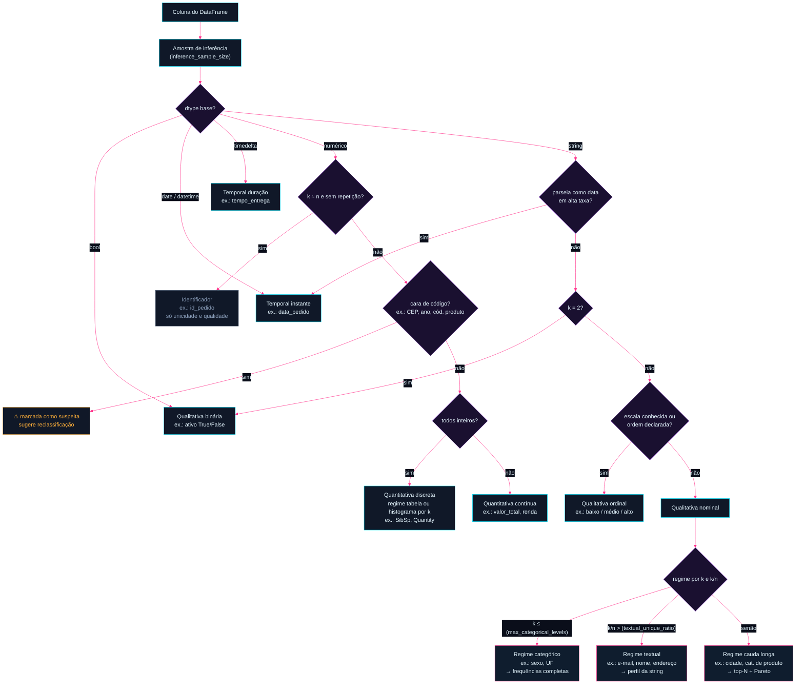
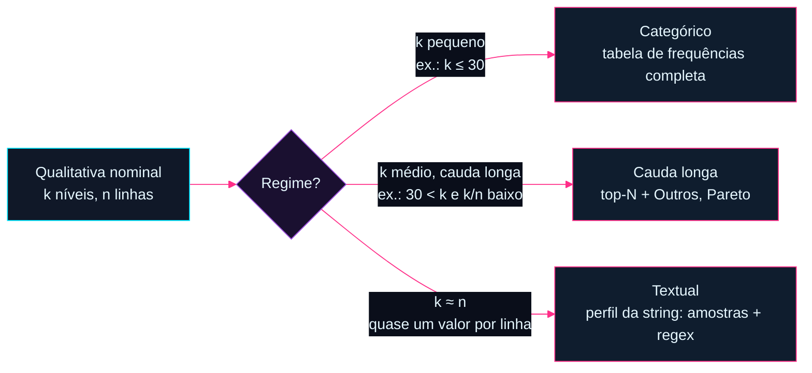

# Fluxo de análises descritivas do maat

Este documento é o mapa conceitual do maat: dado um DataFrame qualquer, **como classificamos cada variável e o que cada classificação nos permite dizer sobre os dados** — tanto em forma de resumos numéricos quanto em nível visual.

É um documento vivo de discussão. Cada seção lista as análises candidatas; ao consolidarmos, marcamos o que entra no MVP e o que fica para depois.

> 🖥️ **Versão interativa**: [`fluxo-interativo.html`](fluxo-interativo.html) — o fluxo de classificação como grafo arrastável, com exemplos e análises no hover de cada nó, na identidade visual do projeto. Versão pública: https://samnkb.github.io/maat/fluxo-interativo.html

---

## 0. Princípios de projeto

1. **A inferência propõe, o usuário dispõe** — todo tipo inferido é sobrescrevível; ambiguidades (cep, ano, rank) são marcadas e apresentadas, nunca decididas em silêncio.
2. **O maat descreve, não julga** *(decisão de 2026-08-16)* — mostramos o que o dado revela naquele momento: contagens, proporções, distribuições, amostras. Sem quality gates, sem limiares de alerta, sem policiar a codificação que o usuário escolheu para os dados dele. O que fazer com o resultado é decisão de quem lê. (Corolário: as checagens do regime textual reportam contagens e amostras de ofensores — nunca um veredito de "aprovado/reprovado".)

   **Corolário — mostrar é obrigação, agir é do usuário** *(2026-08-16)*: "não julgar" nunca significa "esconder". Se o dado tem um problema visível, o maat **mostra o fato** e o usuário decide se corrige — omitir deixaria um dataset ruim passar despercebido. A condição: toda detecção usa **critério determinístico e explícito**, declarado junto do resultado (ex.: "níveis idênticos ao normalizar para minúsculas, sem acentos e com espaços colapsados"), nunca inferência difusa ou semelhança aproximada. O maat nunca une, corrige ou sugere correção — só relata o que a regra encontrou.
3. **Duas camadas em todo perfil** *(decisão de 2026-08-16)* — camada **essencial** (o que qualquer pessoa lê: contagens, %, moda) e camada **completa** (para quem quer profundidade: entropia, razões, forma da distribuição). Medidas que exigem contexto estatístico moram na completa.
4. **O custo mora no backend** — agregações rodam no motor (pandas/Spark); a camada visual recebe apenas dados pré-agregados.

---

## 1. O fluxo geral

O fluxograma completo, do dado bruto até a estratégia de análise — todo losango com parâmetro entre parênteses é configurável pelo usuário (seção 1.2):



### 1.1 Exemplo guiado: `vendas.csv` (100.000 linhas)

Como o classificador enxerga cada coluna de uma tabela de vendas típica:

| Coluna | Amostra de valores | k (distintos) | Classificação | Regime | Por quê |
|---|---|---|---|---|---|
| `id_pedido` | 10001, 10002, … | 100.000 | Identificador | — | inteiro com um valor único por linha; média de id não significa nada |
| `cliente_nome` | "Ana Souza", "J. Pereira" | 98.400 | Nominal | Textual | k ≈ n → frequência é inútil; analisa-se a string (seção 2.4) |
| `cliente_email` | "ana@gmail.com", … | 99.100 | Nominal | Textual | idem; padrão dominante detectado: e-mail |
| `cidade` | "São Paulo", "Recife", … | 3.200 | Nominal | Cauda longa | muita repetição, mas níveis demais para tabela completa |
| `uf` | "SP", "PE", … | 27 | Nominal | Categórico | k pequeno → todos os níveis no resumo |
| `sexo` | "F", "M" | 2 | Binária | — | exatamente 2 níveis |
| `avaliacao` | 1, 2, 3, 4, 5 | 5 | **⚠️ Ordinal (reclassificada)** | Categórico | a heurística diria "discreta" (inteiros, k baixo) — mas é escala Likert: 5 não é "5 unidades", é "melhor que 4". Caso clássico de reclassificação pelo usuário |
| `qtd_itens` | 1, 2, 3, … 14 | 14 | Quantitativa discreta | — | inteiros de contagem: 4 itens **são** o dobro de 2 |
| `valor_total` | 129.90, 45.00, … | 71.000 | Quantitativa contínua | — | casas decimais: mede, não conta |
| `cep` | "01310-100", … | 45.000 | **⚠️ Suspeita** | — | máscara de código: somar/mediar CEP não faz sentido; usuário decide (id? região via prefixo?) |
| `data_pedido` | 2024-05-01 14:32 | — | Temporal instante | — | dtype datetime |
| `tempo_entrega` | 2d 4h 12min | — | Temporal duração | — | dtype timedelta (ou derivada de duas datas) |

As linhas de `avaliacao` e `cep` mostram o princípio central: **a inferência propõe, o usuário dispõe** — todo tipo é sobrescrevível, e os casos ambíguos são marcados em vez de decididos em silêncio.

> 📊 **Exemplos com dados reais**: o [grafo interativo](fluxo-interativo.html) referencia números verdadeiros do benchmark em cada nó (telco `Churn`: No 5.174 · Yes 1.869; titanic `SibSp`: 68,2% zeros; nyc-airbnb `name`: k/n = 0,98; wine `quality`: moda 5 com 42,6%…). Todos reproduzíveis via [`scripts/benchmark_examples.py`](../scripts/benchmark_examples.py).

### 1.2 Parâmetros do usuário

Os limiares de classificação não são constantes do maat — são parâmetros com defaults, expostos numa configuração única:

```python
import maat

profile = maat.describe(df, config=maat.Config(
    max_categorical_levels=30,     # até aqui, regime categórico (frequências completas)
    textual_unique_ratio=0.5,      # fração de valores únicos acima da qual vira regime textual
    max_discrete_levels=30,        # discreta: até k distintos → regime tabela; acima → regime histograma
    discrete_extremes_levels=5,    # regime histograma: n valores mais e n menos frequentes na tabela de extremos
    discrete_extremes_include_middle=False,  # opt-in: acrescenta os n valores do meio do ranking (o histograma já retrata o corpo)
    continuous_extremes_levels=5,  # contínua: n maiores e n menores valores observados na tabela de extremos
    long_tail_top_n=10,            # cauda longa: n níveis na tabela, mais a linha "Outros"
    inference_sample_size=100_000, # linhas amostradas para inferência (None = base inteira)
    sample_size=10,                # N das amostras dirigidas (strings mais curtas/longas, ofensores)
))
```

`inference_sample_size` existe por dois motivos: custo (no Spark, inferir tipos na base inteira é um job pesado) e suficiência (100 mil linhas bastam para decidir se uma coluna é nominal ou textual). A contagem exata de `k` da análise final continua vindo da base inteira — a amostra é só para a **decisão de rota**. Os defaults acima são propostas iniciais a calibrar com uso real.

Regras de inferência (heurísticas iniciais, sempre sobrescrevíveis pelo usuário):

| Sinal na coluna | Tipo inferido |
|---|---|
| dtype categórico/string, cardinalidade baixa em relação a `n` | Qualitativa nominal |
| string com padrão de escala conhecida ("baixo/médio/alto", "P/M/G") ou ordem declarada | Qualitativa ordinal |
| exatamente 2 valores distintos (qualquer dtype) | Qualitativa binária |
| dtype numérico, todos inteiros | Quantitativa discreta — o `k` decide o **regime**: tabela (k baixo) ou histograma (k alto) |
| dtype numérico com casas decimais | Quantitativa contínua |
| dtype date/datetime, ou string que parseia como data em alta taxa | Temporal (instante) |
| dtype timedelta, ou diferença entre colunas de data | Temporal (duração) |
| numérico com cardinalidade ≈ `n` e sem repetição (id) | Identificador — análise reduzida a unicidade e qualidade |
| string com cardinalidade alta (nome, e-mail, endereço) | Qualitativa nominal em **regime textual** (seção 2.4) |

> **Armadilhas conhecidas**: CEP, código de produto e ano são números que *não* são quantitativos (não faz sentido somar CEPs). A inferência deve marcar esses casos como "suspeitos" e sugerir reclassificação. Ano é o caso mais ambíguo: pode ser temporal (eixo) ou ordinal (categoria de agrupamento) dependendo da pergunta.

---

## 2. Qualitativas

### 2.0 Regimes de cardinalidade

Dentro de um mesmo tipo, **a quantidade de níveis muda completamente qual análise faz sentido**. "Sexo" (2–3 níveis) e "e-mail" (um nível por linha) são ambas strings nominais, mas pedem tratamentos opostos. O maat trabalha com três regimes, decididos pela cardinalidade `k` em relação ao total `n`:



| Regime | Exemplo | Estratégia |
|---|---|---|
| **Categórico** (`k` pequeno) | sexo, UF, canal de venda | Tabela de frequências completa — todo nível aparece no resumo e no gráfico |
| **Cauda longa** (`k` médio, muita repetição) | cidade, categoria de produto, CID | Top-N + agregado "Outros"; análise de concentração (Pareto); categorias raras |
| **Textual** (`k` ≈ `n`, quase sem repetição) | nome, e-mail, endereço, descrição | A frequência é inútil (tudo tem contagem ~1) — o objeto de análise passa a ser **a string em si**: comprimentos, amostras extremas, padrões e sujeira via regex (seção 2.4) |

Os limiares exatos entre regimes são **parâmetros do usuário** (seção 1.2) — resta calibrar os defaults com uso real. Importante: o regime **não é um tipo** — é um modificador que seleciona a estratégia dentro do tipo. Uma coluna pode migrar de regime quando os dados crescem.

### 2.1 Nominal em regime categórico (sexo, UF, canal de venda)

**Resumos numéricos**

| Análise | O que responde |
|---|---|
| Tabela de frequências (absoluta, relativa, % acumulada por rank) | Como os dados se distribuem entre as categorias? |
| Moda e força da moda (% da categoria dominante) | Existe uma categoria dominante? |
| Cardinalidade (nº de níveis distintos) | Quantas categorias existem? É gerenciável? |
| Razão de desbalanceamento (maior freq / menor freq) | As classes são equilibradas? |
| Entropia normalizada | A distribuição é concentrada ou espalhada? |
| Contagem/% de ausentes | Qualidade do dado |
| Categorias raras (< x% do total) | Candidatas a agrupamento em "Outros" |

**Visualizações**

| Visual | Quando usar |
|---|---|
| Barras ordenadas por frequência | Padrão para até ~15 categorias |
| Lollipop | Alternativa limpa às barras quando há mais categorias |
| ⚠️ Pizza/donut | Só com ≤ 4 categorias — em geral, evitar |

### 2.2 Nominal em regime cauda longa (cidade, fornecedor) — ✅ consolidada em 2026-08-16

> 🔍 **Página detalhada**: [tipos/cauda-longa.html](tipos/cauda-longa.html) ([versão pública](https://samnkb.github.io/maat/tipos/cauda-longa.html)).

Muitos níveis com repetição relevante: a frequência ainda é o objeto de análise, mas mostrar todos os níveis deixa de ser viável. Protagonistas do benchmark: `neighbourhood` do nyc-airbnb (mansa: k=221, sem variantes) e `txtFornecedor` da cota parlamentar da Câmara (selvagem: k=22.024, 43,1% singletons, 279 grupos de variantes de grafia).

**Camada essencial** *(decisões de 2026-08-16)*:

| Saída | Detalhe |
|---|---|
| **Top-10 + linha "Outros"** | `long_tail_top_n` (default 10). A linha "Outros" informa quantos níveis agrega e sua participação — nunca esconde o tamanho da cauda |
| **Concentração** | Quantos níveis acumulam **50% / 80% / 95%** dos registros. É a leitura que define o regime, em frase pronta: *"36 de 221 bairros concentram 80% dos anúncios"* |
| **Cardinalidade e singletons** | `k` e quantos níveis aparecem uma única vez (Câmara: 9.496 · 43,1% dos níveis) |
| **Contagem de grupos de variantes** | *"279 grupos de níveis tornam-se idênticos ao normalizar"* — o número no essencial; a lista, na completa |

**Camada completa**: índice de concentração (Herfindahl e entropia normalizada, para comparar colunas entre si), lista dos grupos de variantes com suas frequências, e a cauda completa disponível sob demanda.

**Variantes de grafia — o fato que o top-N esconde** *(decisão de 2026-08-16)*: o maat relata grupos de níveis que se tornam **idênticos sob normalização determinística** — minúsculas + remoção de acentos + espaços colapsados + bordas aparadas. Esse critério é **declarado junto do resultado**, é reproduzível e não envolve semelhança aproximada. Caso real da Câmara:

| Nível como está na base | Frequência |
|---|---|
| `UBER DO BRASIL TECNOLOGIA LTDA.` | 10.267 |
| `Uber Do Brasil Tecnologia Ltda.` | 8 |

A mesma empresa dividida em dois níveis pela caixa — sem essa saída, a concentração real fica subestimada e o dataset ruim passa despercebido. **O maat nunca une, corrige nem sugere correção**: mostra o fato e o usuário decide (princípio §0.2, corolário "mostrar é obrigação, agir é do usuário").

**Visualizações**

| Visual | Camada | Quando usar |
|---|---|---|
| Pareto (barras top-10 + linha acumulada) | Essencial | Padrão do regime — mostra concentração e cauda juntas |
| Barras top-10 + "Outros" destacada | Essencial | Versão simples, sem eixo duplo |
| Treemap | Completa | Quando há hierarquia ou muitos níveis médios |

### 2.3 Ordinal (com ordem: escolaridade, faixa de renda, satisfação 1–5)

Herda tudo da nominal, e a ordem habilita mais:

**Resumos numéricos adicionais**

| Análise | O que responde |
|---|---|
| Frequência acumulada **na ordem natural** | "Quantos % estão até o nível X?" |
| Categoria mediana e quartis categóricos | Onde está o centro da distribuição ordenada? |
| Assimetria da distribuição na escala ordinal | A massa está concentrada no topo ou na base da escala? |

**Visualizações**

| Visual | Quando usar |
|---|---|
| Barras **na ordem natural da escala** (nunca por frequência) | Padrão — a ordem é informação |
| Barras divergentes (escala Likert) | Escalas de concordância/satisfação centradas no neutro |
| Barra 100% empilhada única | Ver a composição inteira numa linha só |

### 2.4 Nominal em regime textual (nome, e-mail, endereço)

Quando `k ≈ n`, contar frequências não diz nada — cada valor aparece uma vez. O objeto de análise vira **a própria string**, em três frentes: forma, padrão e sujeira. Como inspecionar milhões de strings é inviável, o método é **estatísticas globais + amostras dirigidas** (não aleatórias: amostras dos casos extremos e dos casos suspeitos).

**Frente 1 — Forma (estatísticas de comprimento e estrutura)**

O comprimento da string é uma variável quantitativa derivada — herda a análise da seção 3:

| Análise | O que responde |
|---|---|
| Distribuição de comprimento (mín, mediana, máx, histograma) | Existe um comprimento "normal"? Bimodalidade sugere dois tipos de dado misturados |
| Amostra das N strings mais curtas | Curtas demais = truncamento, "a", "-", "." usados como preenchimento |
| Amostra das N strings mais longas | Longas demais = campo usado para outra coisa (observações coladas no nome) |
| Nº de tokens/palavras (distribuição) | Nome com 1 token ou 12 tokens é suspeito |
| % de valores vazios-disfarçados ("", " ", "N/A", "null", "-", "sem informação") | Ausência que não aparece como ausência |

**Frente 2 — Padrão (o campo tem um formato esperado?)**

| Análise | O que responde |
|---|---|
| Detecção de padrão dominante via regex (e-mail, URL, telefone, CPF/CNPJ, CEP, UUID) | Que tipo de dado este campo realmente contém? |
| % de aderência ao padrão dominante + amostra das violações | Quanto do campo está "quebrado" e como |
| Máscara de caractere (abstrair `Aa9` : "Rua X, 123" → "Aaa A, 999") e top máscaras | Enxergar os formatos coexistentes sem ler as strings |
| Consistência de caixa (% minúscula, MAIÚSCULA, Título, MiStA) | Padronização de entrada |

**Frente 3 — Sujeira (a bateria de regex de qualidade)**

Cada checagem devolve contagem, % e uma **amostra dos ofensores** (a amostra é o que torna o achado acionável):

| Checagem (regex/verificação) | Sujeira detectada |
|---|---|
| Espaços à esquerda/direita (`^\s|\s$`) | Falha de trim na origem |
| Espaços consecutivos (`\s{2,}`) | Digitação/concatenação malfeita |
| Caracteres invisíveis (zero-width `​-‍`, NBSP ` `, BOM ``) | Copy-paste de web/Excel — invisível ao olho, quebra joins |
| Caracteres de controle/não-imprimíveis (`[\x00-\x1f\x7f]`) | Encoding quebrado, lixo binário |
| Caracteres repetidos em sequência (`(.)\1{3,}`) | "aaaa", "1111" — preenchimento de teclado |
| Mojibake ("é", "ã", "’") | Dupla codificação UTF-8/Latin-1 |
| Mistura de alfabetos (latino + cirílico/grego no mesmo valor) | Homóglifos — erro ou fraude |
| Dígitos em campo nominal / letras em campo numérico | Conteúdo fora do domínio esperado |
| HTML/escape residual (`&amp;`, `<br>`, `\n` literal) | Dado raspado sem limpeza |

**Visualizações**

| Visual | Quando usar |
|---|---|
| Histograma de comprimento | Padrão do regime — a forma da coluna |
| Barras das top máscaras de caractere | Formatos coexistentes no campo |
| Painel de qualidade (barras: % de cada checagem que disparou) | Resumo executivo da sujeira |
| Tabela de amostras dirigidas (curtas, longas, violações) | Não é gráfico, mas é a saída mais acionável do regime |

> Nota Spark: todas as checagens são `filter`/`regexp` distribuídos + `take(N)` para amostras — baratas mesmo em bilhões de linhas. A máscara de caractere é um `regexp_replace` encadeado.

### 2.5 Binária (sim/não, ativo/inativo) — ✅ consolidada em 2026-08-16

> 🔍 **Página detalhada**: [tipos/binaria.html](tipos/binaria.html) — decisões, exemplos reais do benchmark e visuais ([versão pública](https://samnkb.github.io/maat/tipos/binaria.html)). Também acessível clicando no nó "Qualitativa binária" do grafo interativo.

Caso degenerado, mas frequente o bastante para merecer saída própria e enxuta.

**Camada essencial** — tabela de frequência com o nulo como cidadão de primeira classe. Números reais de `Churn` no dataset telco-churn do benchmark (n = 7.043; reproduzível via `scripts/benchmark_examples.py`):

| nível | absoluto | % do total | % dos válidos |
|---|---|---|---|
| No | 5.174 | 73,5% | 73,5% |
| Yes | 1.869 | 26,5% | 26,5% |
| *(ausente)* | 0 | 0,0% | — |

As duas colunas de % eliminam a ambiguidade "% de tudo ou % de quem respondeu?" quando há nulos. (Curiosidade do benchmark: os famosos 11 valores em branco do telco não estão em `Churn` — estão em `TotalCharges`, numérico-em-string; um lembrete de verificar antes de exemplificar.)

**Camada completa**: nível dominante e razão de balanceamento (ex.: 2,8:1) — mora aqui porque razões exigem leitura estatística.

**Fora, por decisão**:
- *Intervalo de confiança* — inferência, não descrição; o maat não presume que o dado é amostra de algo maior.
- *Checagem de codificação e detecção de par semântico* — o maat não julga como o usuário codifica seus dados (princípio 2). Quando as bivariadas chegarem, o nível de referência será declarado pelo usuário.
- *Alertas por limiar* — quality gate é papel de outra ferramenta. Nota: um 3º valor distinto não é aviso — a coluna simplesmente deixa de ser binária e a classificação a leva para nominal.

**Visual**: barra única de proporção ou big number. Gráfico com duas barras é desperdício de tela.

---

## 3. Quantitativas

### 3.1 Discreta (contagens: nº de filhos, nº de itens no pedido) — ✅ consolidada em 2026-08-16

> 🔍 **Página detalhada**: [tipos/discreta.html](tipos/discreta.html) ([versão pública](https://samnkb.github.io/maat/tipos/discreta.html)), também via clique no nó do grafo interativo.

**Decisão estrutural**: contagem é contagem — **inteiros são sempre discreta**, independente da cardinalidade. O `k` escolhe o **regime de apresentação** (mesma filosofia dos regimes da nominal, seção 2.0):

| Regime | Quando | Exemplo real | Apresentação |
|---|---|---|---|
| **Tabela** | `k ≤ max_discrete_levels` | titanic `SibSp` (k=7) | frequência por valor exato — mostra tudo, inclusive buracos (não existe SibSp=6) |
| **Histograma** | `k` acima do limiar | ecommerce `Quantity` (k=722) | histograma de bins inteiros + resumo + **tabela de extremos de frequência** |

**Camada essencial**: tabela por valor (regime tabela) com ausentes como linha, mínimo, máximo, moda, **média e mediana** — o par média × mediana já conta a história da assimetria sem jargão (`SibSp`: média 0,52 vs mediana 0).

**Camada completa**: desvio padrão, quartis, % de zeros (no regime tabela o zero já aparece na tabela; no histograma o % de zeros vira estatística própria — `Parch`: 76,1% zeros).

**Fora, por decisão** (2026-08-16): **soma total** — mesmo sendo significativa em contagens (`SibSp` soma 466; `Quantity` soma 5.176.450), é leitura de negócio, não descrição de distribuição; o usuário soma por conta própria se quiser.

**Tabela de extremos de frequência** *(decisão de 2026-08-16)*: no regime histograma a tabela de frequência não morre — encolhe. Entram os `discrete_extremes_levels` valores **mais frequentes** e os mesmos **menos frequentes** (default 5 + 5, parametrizável). No `Quantity` real: os mais frequentes revelam o varejo — 1 (27,4%), 2 (15,1%), **12 (11,3% — a dúzia)**, 6, 4; nos menos frequentes, os 308 valores empatados em frequência 1 são desempatados pelos **mais extremos primeiro**, entregando exatamente os outliers que contam história: ±80.995 e ±74.215 (pedidos gigantes e seus cancelamentos).

Nota do regime histograma: valores negativos aparecem como fato no mín/máx e na cauda do histograma (`Quantity`: mín -80.995, 1,96% negativos — devoluções), sem juízo de "erro".

**Visualizações**

| Visual | Quando usar |
|---|---|
| Barras por valor exato | Regime tabela — cada valor inteiro é uma barra |
| Histograma com bins inteiros | Regime histograma |
| ECDF | Completa — "% de casos até k" |

### 3.2 Contínua (renda, preço, temperatura) — ✅ consolidada em 2026-08-16

> 🔍 **Página detalhada**: [tipos/continua.html](tipos/continua.html) ([versão pública](https://samnkb.github.io/maat/tipos/continua.html)), também via clique no nó do grafo interativo.

Medições em escala real — o caso mais rico da estatística descritiva clássica. Protagonistas do benchmark: `MonthlyCharges` do telco (bem-comportada: assimetria -0,22, zero atípicos) e `price` do nyc-airbnb (selvagem: assimetria 19,1, máx 10.000, 11 anúncios a preço 0).

**Camada essencial** *(decisão de 2026-08-16)*: o **resumo de cinco números + média** — mínimo, q1, mediana, média, q3, máximo — mais o histograma e a **tabela de extremos de valor** (os 5 maiores e 5 menores valores observados, com contagem quando o valor se repete — no `price`: "0 (×11)" e "10.000 (×3)" aparecem sem nenhum jargão). Parâmetro: `continuous_extremes_levels` (default 5).

**Camada completa**: quantis de cauda (p1, p5, p95, p99), desvio padrão, IQR, coeficiente de variação, assimetria, curtose, **contagem de valores atípicos pela regra 1,5×IQR** (`price`: 2.972 · 6,08% — descritos, nunca julgados como erro), ECDF e boxplot.

**Narrativa** traduz forma e atípicos em palavras: *"a média (152,72) supera a mediana (106,00), indicando distribuição assimétrica à direita — valores extremos elevam a média, e a mediana representa melhor o caso típico"*. Quando média ≫ mediana, a narrativa sugere leitura em escala logarítmica.

> Pegadinha registrada: `price` do nyc é armazenado como **inteiro** (dólares cheios) — a heurística o classificaria como discreta em regime histograma. É o caso-exemplo de **reclassificação para contínua** (medição arredondada não é contagem), simétrico ao `quality` do wine (inteiro que é escala Likert → ordinal). A inferência propõe, o usuário dispõe.

> Nota Spark: quantis exatos são caros em dados distribuídos — usar `approxQuantile` com erro configurável. O contrato do backend expõe isso (exato no pandas, aproximado no Spark, com o erro reportado no resultado).

**Visualizações**

| Visual | Camada | Quando usar |
|---|---|---|
| Histograma | Essencial | Padrão — forma geral da distribuição |
| Boxplot | Completa | Resumo compacto + atípicos evidentes |
| ECDF | Completa | Leitura direta de percentis, sem escolha de bins |
| Densidade (KDE) | Completa | Forma suavizada; sobreposição de grupos |
| QQ-plot (vs. normal) | Fase 2 | Diagnóstico de normalidade |

---

## 4. Temporais — o tipo que não se encaixa

**Por que data nunca coube em qualitativa nem quantitativa?** Porque um timestamp carrega as duas naturezas ao mesmo tempo:

1. **Eixo contínuo**: o tempo é uma reta ordenada — dá para calcular mínimo, máximo, amplitude (cobertura), gaps. Isso é comportamento quantitativo (escala intervalar: diferenças fazem sentido, razões não — "dia 20" não é "duas vezes o dia 10").
2. **Componentes cíclicos**: mês, dia da semana, hora do dia são categorias **ordinais e circulares** (dezembro é "vizinho" de janeiro). Isso é comportamento qualitativo, mas com uma topologia que nem a ordinal comum tem.

A solução do maat: temporal é um **tipo de primeira classe** que, na análise, se **decompõe** — gera automaticamente derivadas qualitativas (mês, dia da semana, hora, trimestre) e quantitativas (posição na linha do tempo, durações), e cada derivada herda o fluxo de análise do seu tipo.

### 4.1 Instante (data da venda, timestamp do evento)

**Resumos numéricos**

| Análise | O que responde |
|---|---|
| Cobertura: mínimo, máximo, amplitude | Que período os dados cobrem? |
| Granularidade detectada (diária? horária? mensal?) | Qual a resolução real do dado? (se toda hora é 00:00, é diário disfarçado) |
| Contagem de registros por período | Volume ao longo do tempo — a análise temporal mais básica |
| Gaps e buracos (períodos sem registros) | Falhas de coleta ou sazonalidade extrema? |
| Duplicatas de timestamp | Eventos simultâneos são esperados? |
| Perfil cíclico: distribuição por mês, dia da semana, hora | Existe sazonalidade? (cada componente vira uma análise ordinal) |
| Datas no futuro / anteriores a limiar plausível (ex.: 1900) | Qualidade do dado |
| % ausentes | Qualidade do dado |

**Visualizações**

| Visual | Quando usar |
|---|---|
| Linha do tempo de contagens (por dia/semana/mês) | Padrão — volume ao longo do tempo |
| Barras por componente cíclico (dia da semana, mês, hora) | Sazonalidade — um painel por componente |
| Heatmap calendário | Padrões diários em períodos longos (estilo GitHub) |
| Heatmap hora × dia da semana | Padrões de comportamento intra-semana |
| Faixa de gaps sobre a linha do tempo | Evidenciar buracos de coleta |

### 4.2 Duração (tempo de entrega, tempo de sessão)

Durações **são** quantitativas contínuas (razões fazem sentido: 4h é o dobro de 2h) — herdam toda a seção 3.2. O que muda:

- Unidade de exibição inteligente (segundos → minutos → horas → dias conforme a magnitude).
- Distribuições de duração são quase sempre assimétricas à direita → sugerir log/percentis por padrão, e mediana como resumo principal (não média).
- Durações negativas = erro de dado → checagem de qualidade específica.

---

## 5. Análises bivariadas (cruzamentos)

A matriz tipo × tipo define o que faz sentido cruzar. MVP: usuário escolhe os pares; futuro: sugestão automática dos pares mais informativos.

| | Qualitativa | Quantitativa | Temporal |
|---|---|---|---|
| **Qualitativa** | Tabela de contingência (absoluta e %), qui-quadrado, V de Cramér · *Visual*: heatmap, barras agrupadas/100% empilhadas | — | — |
| **Quantitativa** | Estatísticas por grupo (média, mediana, dp por categoria) · *Visual*: boxplots lado a lado, densidades sobrepostas | Correlação (Pearson, Spearman) · *Visual*: dispersão (+ amostragem/hexbin no Spark), linha de tendência | — |
| **Temporal** | Contagem por período quebrada por categoria · *Visual*: linhas múltiplas, área 100% empilhada (composição ao longo do tempo) | Agregado (média/mediana/soma) por período · *Visual*: linha temporal da métrica, com banda de quantis | (raro — ex.: duração vs. data do evento → tratado como temporal × quantitativa) |

> Nota Spark: dispersão com milhões de pontos não é plotável — o backend deve amostrar ou pré-agregar (hexbin/grade 2D) antes de qualquer visual quanti × quanti.

---

## 6. O que uma análise devolve (contrato de saída)

Para manter pandas e Spark equivalentes, toda análise devolve uma estrutura padronizada, independente do backend:

```
ColumnProfile
├── name, inferred_type, confiança da inferência
├── quality: {n, n_missing, pct_missing, alertas de qualidade}
├── summary: dict de estatísticas (as tabelas das seções 2–4)
├── viz_suggestions: lista ordenada de {tipo_de_gráfico, dados_pré-agregados, motivo}
└── notes: observações geradas ("distribuição assimétrica — considere escala log")
```

Ponto importante para o Spark: **as visualizações nunca recebem os dados brutos** — recebem os dados já agregados/amostrados pelo backend (contagens por bin, frequências por categoria). Assim o custo distribuído fica no backend e a camada visual é sempre local e leve.

---

## 7. Narrativas geradas (data-to-text) — ✅ arquitetura decidida em 2026-08-16

O maat gera, junto com cada perfil, **prosa pronta para uso** — o caso motivador é quem monta trabalho de graduação e precisa escrever "o que os dados estão dizendo". Exemplo real (telco `Churn`, tom acadêmico):

> A variável **Churn** é qualitativa binária, observada em 7.043 registros, sem valores ausentes. O nível predominante é **No**, presente em 5.174 registros (73,5% do total), enquanto **Yes** corresponde a 1.869 registros (26,5%).

**Arquitetura (decisão)**:

1. **Núcleo determinístico**: templates por tipo/regime em **pt-BR e inglês**, preenchidos com os números do `ColumnProfile`. Sem dependências, offline, números que nunca mentem. Tom do MVP: **acadêmico** (outros tons ficam para depois).
2. **Plug opcional de LLM local e gratuito (Ollama)** — nunca APIs de nuvem por padrão: o dado do usuário não sai da máquina. O LLM **não gera análise**: só reformula/traduz o texto-template pronto para outros idiomas ou estilos. Modelos sugeridos (pequenos bastam para reformular): Llama 3.2 3B, Gemma 3 4B, Qwen 2.5 3B.
3. **Trava de números**: após qualquer reformulação, validação determinística — todos os números do template original devem aparecer intactos no texto reformulado (comparação dos tokens numéricos dos dois lados). Se o LLM alterou um número, o texto é descartado e o usuário recebe o template original com aviso. Alucinação numérica vira erro detectado, não risco silencioso.

```python
maat.describe(df, config=maat.Config(
    language="pt-BR",              # idioma do núcleo de templates (pt-BR | en)
    narrative_tone="academico",    # MVP: só acadêmico
    narrative_llm=None,            # ex.: "ollama/llama3.2:3b" — opcional, local
))
```

## 8. Questões em aberto (para discutirmos)

1. ~~Limiares entre regimes de cardinalidade: fixos ou relativos?~~ → **Direção definida**: os limiares são **parâmetros do usuário** com defaults (seção 1.2), incluindo o tamanho da amostra de inferência. Falta calibrar os defaults com uso real.
2. **Ordem das ordinais**: inferimos por dicionários de escalas conhecidas (pt/en) ou exigimos declaração do usuário no MVP?
3. **Amostragem no Spark**: qual o padrão de erro aceitável para `approxQuantile` e qual o tamanho de amostra para visuais? E o `N` das amostras dirigidas do regime textual (seção 2.4)?
4. **Saída do relatório**: HTML estático primeiro? Ou dict/JSON estruturado primeiro e o HTML como renderização por cima (recomendado)?
5. ~~Texto livre: fora do MVP?~~ → **Resolvido**: alta cardinalidade textual entrou no MVP como regime da nominal (seção 2.4), com perfil de forma/padrão/sujeira em vez de análise de frequência.
6. **Bateria de regex do regime textual**: a lista da seção 2.4 (frente 3) é a inicial — quais checagens entram no MVP e quais ficam configuráveis/extensíveis pelo usuário?
7. **Regimes de cardinalidade valem para a ordinal?** → **Adiado até casos reais** (decisão de 2026-08-16): escolaridade e Likert cabem no categórico; rating de crédito (AAA…D) e patentes militares seriam candidatos a cauda longa, mas sem dataset real na mão não definimos. Fica registrado para retomar.
8. **Subtipo `rank`** (decisão de 2026-08-16: criar; **aguardando testes em datasets reais** antes de consolidar posição na taxonomia e regras de identificação): ordinal com k ≈ n (colocação na maratona: 1º…40.000º, cada valor único) vira um subtipo próprio — pode ser lida como id, como quantitativa discreta ou como ordinal, e por isso merece rota própria. Propostas sobre a mesa, a validar com dados:
   - *Onde pendura na taxonomia?* Proposta: subtipo da qualitativa (família ordinal — a natureza do dado é ordem), com as análises emprestadas da quantitativa discreta (mediana da posição, quartis de colocação).
   - *Identificação assertiva*: o desafio é que, estatisticamente, um rank e um id sequencial são **idênticos** (inteiros densos 1…n, sem repetição). O padrão numérico sozinho não separa `colocacao` de `id_pedido` — o desempate precisa vir de fora da distribuição: nome da coluna (dicionário: posição/rank/colocação/lugar vs. id/código/chave), e, na ambiguidade, marcar como suspeita e perguntar ao usuário em vez de decidir em silêncio.
